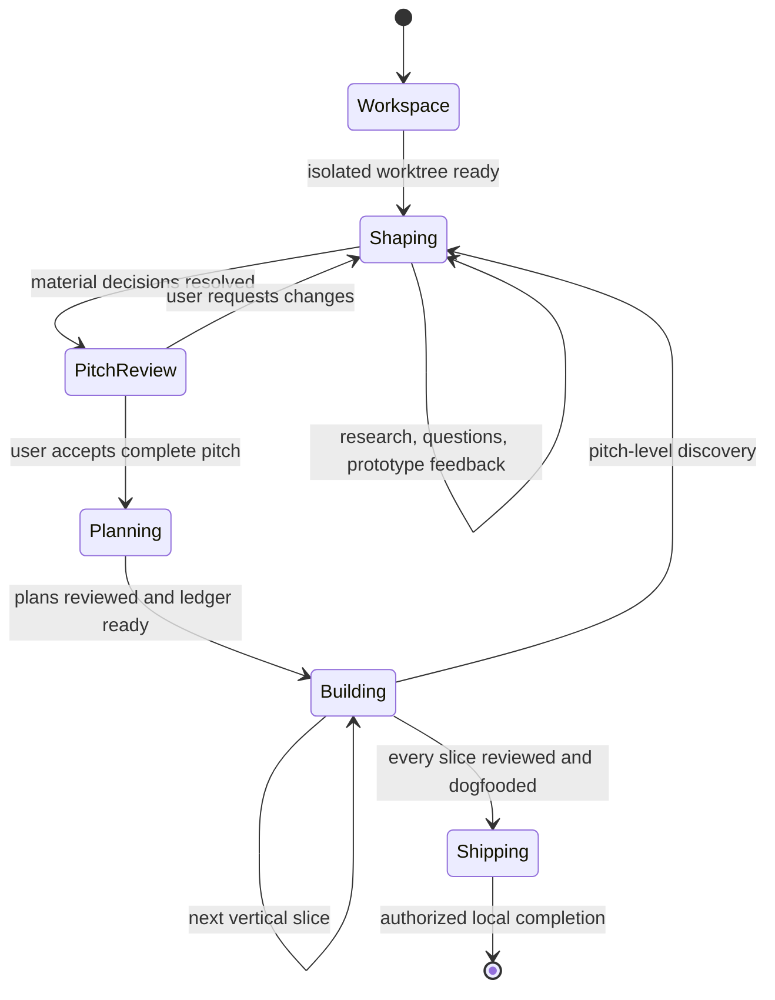
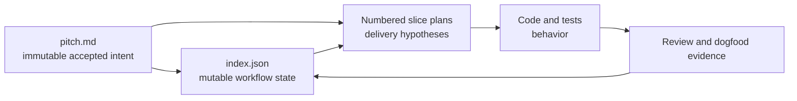
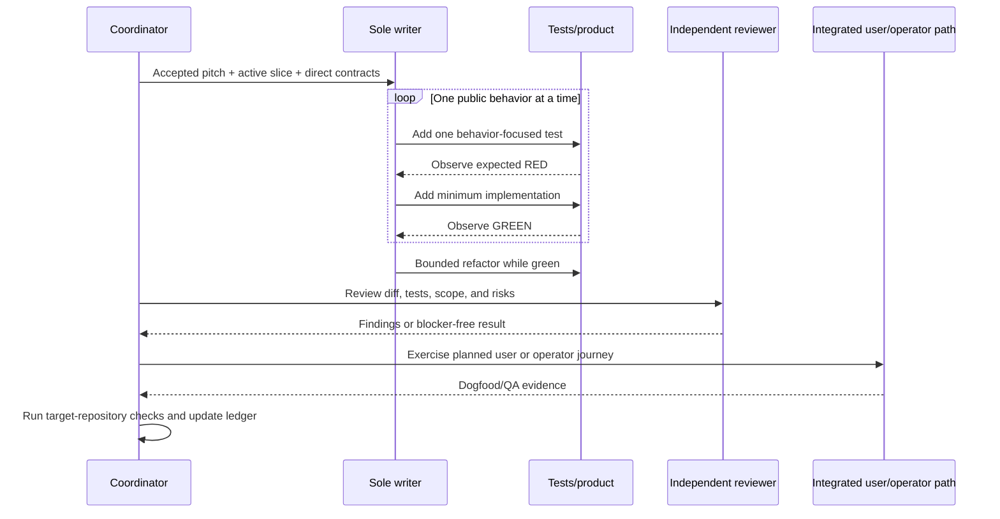

# Shape: an AI-first feature delivery flow

## Executive summary

A user should be able to say, “we’re working on a feature,” add a brief, and let
Pi guide the feature from an isolated worktree through research, an accepted
cross-functional pitch, vertical-slice plans, test-driven implementation,
dogfooding, review, and shipping preparation.

The public entry point is the verb **shape**. Natural feature briefs should load
the skill automatically; `/shape` is the short explicit fallback and resumes an
existing feature when called without a brief.

Human attention is deliberately front-loaded. The user collaborates heavily
while the problem, evidence, product behavior, boundaries, and risks are still
cheap to change. Once the complete pitch is accepted, routine planning,
implementation, review, and QA continue without ceremony. The workflow returns
to the user only for a decision that would change the accepted pitch or for an
external or destructive action that was not already authorized.

## Problem

### Motivating story

Today, a feature request does not reliably activate one end-to-end workflow. The
user has to remember how to ask for research, how the pitch should be written,
when to create a worktree, how plans should be sliced, what TDD means, how QA
should be recorded, and how work should resume after the conversation stops.
That process knowledge lives in repeated prompting instead of the product.

The current `@mopeyjellyfish/pi-feature-flow` branch improves parts of this, but
its public contract still requires three separate skills:

1. `feature-pitch`
2. `feature-plan`
3. `feature-build`

It also creates or activates the feature worktree only during Build, after
shaping and planning have already happened elsewhere. Its accepted pitch format
allows exactly five second-level headings and intentionally excludes delivery
context. Plans are forced into one direct serial chain. Progress exists only in
session todo state, so a new session cannot know which slice is active or what
was verified.

### Repository evidence

The current branch was inspected before reshaping:

- the worktree was clean and tracked
  `origin/plan/shape-up-development-flow`;
- the focused package suite passed **79 of 79 tests**;
- the deterministic helper contains 574 lines;
- six core skill and contract files contain 471 lines and 3,288 words;
- orchestration details such as fresh context, one-item task groups, progress
  flags, run IDs, waits, and terminal barriers are repeated across files; and
- `skills.test.ts` mainly asserts prose substrings and ordering rather than
  natural triggering or end-to-end behavior.

The previous accepted pitch and reviewed plans remain immutable historical
artifacts at [`pitch-v001.md`](pitch-v001.md) and
[`plans-v001/`](plans-v001/).

### Why this matters

The repeated prompting has three costs:

- **Product cost:** important questions, prior art, boundaries, or failure cases
  can be skipped because the user must remember to request them.
- **Engineering cost:** horizontal plans, stale assumptions, and weak QA are
  easier to produce when the pitch is not a durable product-engineering
  contract.
- **Agent cost:** repeated procedural instructions consume context and can make
  frontier models follow old tool choreography instead of using the current
  tool contracts and repository guidance.

The desired outcome is not more project-management ceremony. It is one durable,
human-editable decision artifact and one small machine-readable resume record,
so agents can spend their context on the feature rather than reconstructing the
process.

## Appetite

### Qualitative investment

This is worth a focused package redesign because it removes recurring prompt
work from every future feature. The result should stay a skill-only package with
a small Node-standard-library helper and no runtime dependency. The helper may
grow only where state, hashing, canonical paths, or validation make model
behavior safer and simpler.

### Scope control

Scope may flex in these areas:

- exact wording and optional subsections in pitch and plan templates;
- which research or review roles are useful for a particular feature;
- which target-repository tools are applicable; and
- how many vertical slices a feature needs.

The first useful version does not need a generic workflow engine, a production
extension, a database, model routing, concurrent writers, or remote publication.

### Quality floors

Scope must not trade away:

- worktree isolation before shaping artifacts or feature research are written;
- a complete, human-accepted and immutable pitch before implementation plans;
- observable red-before-green TDD at public seams;
- independent review plus dogfood/QA for every completed slice;
- target-repository required checks;
- safe source-control authorization boundaries; or
- a ledger that can deterministically identify the next action after restart.

### Stop and reshape conditions

Stop autonomous work when a discovery would change the accepted problem,
product behavior, non-negotiable boundary, material risk, or acceptance
criterion. Preserve the accepted pitch bytes, archive them as the next
`pitch-vNNN.md`, and create a new draft `pitch.md`. Resume planning and Build
only after the new complete pitch is accepted.

## Research and prior art

### Frontier-model skill guidance

The design follows current primary guidance rather than assuming longer prompts
produce more reliable agents:

| Evidence                                                                                                                                                                                 | Finding                                                                                                                                                                            | Consequence here                                                                                                                  |
| ---------------------------------------------------------------------------------------------------------------------------------------------------------------------------------------- | ---------------------------------------------------------------------------------------------------------------------------------------------------------------------------------- | --------------------------------------------------------------------------------------------------------------------------------- |
| [Pi Skills documentation](https://github.com/badlogic/pi-mono/blob/main/packages/coding-agent/docs/skills.md) and the [Agent Skills specification](https://agentskills.io/specification) | Only skill names and descriptions are always present; the body and resources are progressively disclosed.                                                                          | The `shape` description must contain natural feature-start and resume triggers. Phase detail moves to directly linked references. |
| [Anthropic Skill authoring best practices](https://platform.claude.com/docs/en/agents-and-tools/agent-skills/best-practices)                                                             | Keep skills concise, link references directly, match strictness to risk, use deterministic scripts for objective operations, and test triggering separately from task performance. | `SKILL.md` becomes a compact coordinator. Shaping remains flexible; ledger transitions and source-control gates are strict.       |
| [Anthropic, Building effective agents](https://www.anthropic.com/engineering/building-effective-agents)                                                                                  | Start with the simplest pattern that works; use workflows for predictable paths and agents where semantic judgment is required.                                                    | The helper owns only mechanical state. The parent model owns research, questions, slicing, and judgment.                          |
| [OpenAI Codex skills](https://developers.openai.com/codex/skills/)                                                                                                                       | Keep each skill focused, prefer instructions to scripts unless behavior must be deterministic, state inputs and outputs, and test description triggers.                            | One end-to-end feature-delivery job is exposed through one skill; scripts do not replace reasoning.                               |
| [OpenAI model guidance](https://developers.openai.com/api/docs/guides/latest-model)                                                                                                      | Leaner prompts improved internal coding-agent evals directionally while reducing tokens and cost; changes still require representative evals.                                      | Repeated tool-call JSON and role boilerplate are removed, then checked with trigger and execution scenarios.                      |
| [Anthropic, Effective context engineering for AI agents](https://www.anthropic.com/engineering/effective-context-engineering-for-ai-agents)                                              | Preserve high-signal context and retrieve detail just in time.                                                                                                                     | Each worker receives the accepted pitch, active slice, direct contracts, and relevant code—not the full shaping transcript.       |

### Shape Up

Basecamp’s [Shape Up](https://basecamp.com/shapeup) supplies the useful product
mechanics: define the problem, set an appetite, rough out the solution, close
rabbit holes, declare no-gos, and communicate the result in a pitch. The
workflow keeps those decisions and removes betting tables, staffing cycles,
hill charts, and other human organization ceremonies.

The most relevant primary chapters are:

- [Set Boundaries](https://basecamp.com/shapeup/1.2-chapter-03);
- [Risks and Rabbit Holes](https://basecamp.com/shapeup/1.4-chapter-05);
- [Write the Pitch](https://basecamp.com/shapeup/1.5-chapter-06);
- [Get One Piece Done](https://basecamp.com/shapeup/3.2-chapter-11); and
- [Map the Scopes](https://basecamp.com/shapeup/3.3-chapter-12).

Worktree-before-ideation, per-slice dogfooding, and a machine-readable resume
ledger are intentional agent adaptations. Shape Up does not prescribe them.

### Test-driven development

[Matt Pocock’s TDD skill](https://raw.githubusercontent.com/mattpocock/skills/main/skills/engineering/tdd/SKILL.md)
provides the strongest test-quality rules for this workflow:

- test observable behavior through an agreed public seam;
- derive expected values from an independent source of truth;
- observe one failing test before production implementation;
- add only enough code to make that test pass; and
- repeat as vertical tracer bullets instead of writing all tests and then all
  implementation.

[Martin Fowler’s TDD description](https://martinfowler.com/bliki/TestDrivenDevelopment.html)
retains refactoring as an essential part of the practice. The adopted synthesis
is repeated one-test red/green cycles followed by bounded review and refactoring
while green before the slice is dogfooded and closed. Refactoring is not deferred
across the whole feature.

### Durable workflow artifacts

[GitHub Spec Kit](https://github.com/github/spec-kit) demonstrates the value of
separating specification, planning, tasks, and implementation. This workflow
adopts that artifact separation, not Spec Kit’s complete command or state
surface.

Git history is the event history for this workflow. A separate append-only event
log would duplicate it and is not justified yet.

#### Ledger format decision

No credible primary evidence shows that frontier agents reason more accurately
from YAML than JSON. [OpenAI Structured Outputs](https://developers.openai.com/api/docs/guides/structured-outputs)
uses strict JSON Schema, recommends clear keys, and calls for evals.
[Anthropic tool definitions](https://platform.claude.com/docs/en/agents-and-tools/tool-use/implement-tool-use)
use JSON `input_schema` plus schema-valid examples; Anthropic’s separate
[Skill authoring guidance](https://platform.claude.com/docs/en/agents-and-tools/agent-skills/best-practices)
recommends representative skill evaluations. [RFC 8259](https://www.rfc-editor.org/rfc/rfc8259)
deliberately keeps JSON small and interoperable. Agent Skills use YAML
frontmatter for small human-authored metadata, not as a recommendation for
mutable machine state.

Use **top-level `index.json`**. The pitch and slice plans remain the
human-oriented artifacts; the ledger is the optimized machine record that humans
can still inspect or edit when necessary. The helper accepts narrow arguments,
returns bounded JSON, parses with Node’s native `JSON.parse`, validates a closed
schema, and writes canonical two-space-indented JSON atomically with
`JSON.stringify`. This removes a parser dependency and any JSON-to-YAML
translation boundary. Prose and comments belong in the pitch or plans, not the
state file. Trigger and resume evals include malformed and hand-edited ledger
cases.

## Solution

### User experience

The normal start is natural language:

> We’re working on a feature that lets users resume interrupted uploads.

The explicit fallback is:

```text
/shape let users resume interrupted uploads
```

With no argument, `/shape` first checks the current routed worktree for its
canonical ledger. From a shared checkout, it enumerates Worktrunk’s linked
worktrees and validates candidate `docs/features/*/index.json` files without
mutating them. One valid candidate is activated and resumed; several candidates
are shown in one structured choice; no candidate asks for a feature brief. Stale
candidates whose recorded branch or base facts do not match are reported but not
adopted.

The helper derives the current phase, active slice, and next action from the
pitch and slice records instead of persisting duplicate projections.

The end-to-end flow is:



### Workspace first

Creating or activating the feature worktree is the first workflow side effect.
Before doing so, the coordinator may read only repository instructions, bounded
Git/Worktrunk facts, and candidate ledgers needed to preserve unrelated work,
resolve resume identity, and choose the correct base. Feature ideation and
research begin after routing.

If the session is already routed to the recorded feature worktree, the skill
adopts it. Otherwise it uses Worktrunk to create `shape/<feature-slug>` from the
repository’s verified base. If the checkout is dirty, has no clear base, or the
branch name collides with a worktree lacking a valid ledger, ask one structured
routing question before the first side effect. Worktrunk remains the lifecycle
authority; hook approval stays human-owned. The skill does not fall back to a
hidden raw Git worktree implementation.

Only after route verification may the coordinator create the feature directory,
initial ledger, pitch, prototype, plan, or other feature artifact.

### Canonical feature directory

```text
docs/features/<feature>/
├── pitch.md
├── index.json
├── plans/
│   ├── 001-<vertical-outcome>.md
│   └── 002-<vertical-outcome>.md
├── assets/
└── prototypes/
```

Only the top-level `pitch.md` and `index.json` are mandatory. Create `assets/` for images
or other non-Markdown material linked from the pitch. Create `prototypes/` only
when a prototype materially helps answer a shaping question. Do not create empty
scaffolding directories.

The accepted contract is self-contained in `pitch.md`. Linked screenshots,
mockups, prototypes, and source files are illustrative evidence, not normative
requirements; changing or deleting them cannot change accepted meaning. Any
exact normative API, schema, or protocol fragment must be embedded in the pitch.
A hash or link never substitutes for normative content.

Accepted historical pitches are preserved as `pitch-vNNN.md`; their matching
plans are preserved as `plans-vNNN/` when a repitch invalidates the current set.



### Shaping loop

The coordinator first learns what the brief, repository, tests, history,
documentation, experiments, and primary external sources can answer. It does not
ask the user to repeat facts available from those sources.

It then asks unresolved product and cross-functional decisions in compact,
adaptive batches—normally up to four related questions. Every question should
include a recommendation, material tradeoffs, and concrete examples where
useful. Questions may cover:

- motivating behavior and user outcome;
- appetite, quality floors, and scope cuts;
- product rules and failure behavior;
- compatibility, migration, privacy, security, and accessibility;
- what is non-negotiable versus agent discretion; and
- evidence needed to call the feature successful.

Research continues between question rounds whenever an answer exposes a new
unknown. The coordinator stops asking when no unresolved decision can materially
change the pitch.

### Prototypes, diagrams, and assets

Show rather than tell when interaction or visual design remains ambiguous. Use
the target application’s existing development server when possible. Otherwise,
use the smallest static HTML/CSS/JavaScript prototype and a standard-library
static server with live reload only when the available tooling already provides
it.

Give the user a URL and ask questions against the running artifact. Keep only
prototype source, screenshots, or assets that remain useful evidence for the
accepted decision. Generated dependencies, build output, and throwaway captures
do not belong in the repository.

Use Mermaid directly in `pitch.md` for flows, sequences, states, boundaries, and
architecture. Put screenshots, mockups, and other binary assets under `assets/`
and link them with a caption and decision context.

### Cross-functional pitch

The pitch is a product and engineering contract, not a generated task list. It
contains, when material:

- an executive summary and motivating story;
- the problem, evidence, and why it matters;
- qualitative appetite, scope control, and quality floors;
- repository research and external prior art with implications;
- alternatives considered and why they were rejected;
- the broad solution and user experience;
- Mermaid diagrams, code or contract snippets, and linked assets;
- product, data, system, security, accessibility, operational, and migration
  boundaries;
- non-negotiables and explicit agent discretion;
- contained rabbit holes and closed no-gos; and
- observable acceptance criteria.

Illustrative snippets and linked assets are marked as non-normative. Exact
normative API, schema, or protocol fragments are embedded in the pitch; a linked
file or hash is evidence only. The pitch also states its local banking policy
explicitly;
acceptance authorizes slice commits only when repository guidance permits them.

A fresh independent review challenges value, completeness, feasibility,
simplicity, contradictions, and unresolved risk. The workflow cannot accept a
pitch or close a slice without a separate read-only reviewer capability. Routine
findings are fixed without another user gate. The whole rendered pitch is then
shown through one structured acceptance question. Acceptance first changes the
pitch frontmatter `status` to `accepted`, then records the final file’s SHA-256 in
the ledger and freezes its bytes. The ledger does not duplicate pitch status.

### Pitch immutability

The accepted pitch is never edited in place. If a pitch-level discovery occurs:

1. stop Build;
2. move the accepted bytes to the next `pitch-vNNN.md` archive;
3. archive the affected plan directory as `plans-vNNN/`;
4. create a new draft `pitch.md` containing the old decisions plus the proposed
   change;
5. ask only the newly material questions;
6. review and accept the complete new pitch; and
7. regenerate or revalidate pending plans against the new pitch hash.

Completed code and commits remain banked. The new plan decides whether they are
retained, adapted, or reverted.

### Vertical-slice planning

Planning begins automatically after pitch acceptance. The planner creates the
smallest coherent set of numbered vertical slices. Each plan crosses every
frontend, backend, persistence, protocol, documentation, or operational
boundary required for one observable outcome. Horizontal phases such as “build
the backend,” “write all tests,” or “add the UI later” are rejected.

Every plan requires:

- a clear goal stated as an observable outcome;
- exact links to the pitch sections and acceptance criteria it advances;
- dependencies and the predecessor postconditions it relies on;
- the public seam, independent expected result, and first red/green tracer;
- applicable focused checks and an integrated user or operator dogfood path; and
- objective completion criteria.

Add scope cuts, boundaries crossed, implementation route, later-cycle guidance,
risks, or escalation conditions only when they materially help the slice. Plans
must not become speculative task inventories.

Plans are reviewed as a complete set for coverage, verticality, simplicity,
feasibility, useful ordering, and avoidable dependencies. The user does not
approve plans. A new pitch-level decision returns to shaping; ordinary planning
choices remain agent-owned.

Pending future plans may be refined, split, merged, or reordered as
implementation teaches us more. The active plan freezes when its slice starts;
completed plans remain historical evidence.

### Coordinator ledger

Top-level `index.json`, beside `pitch.md`, is the only mutable workflow
authority. Pitch frontmatter owns pitch status; plan files contain no mutable
status. The helper uses Node’s native JSON parser, validates a closed schema,
and replaces the ledger atomically. Git preserves its history.

A representative shape is:

```json
{
  "schema": "feature-flow/v3",
  "feature": "ai-feature-flow",
  "worktree": {
    "branch": "shape/ai-feature-flow",
    "base_sha": "56be8274f0edb6be6595b66f147efcc85b7a4097"
  },
  "pitch": {
    "path": "pitch.md",
    "number": 2,
    "sha256": "<accepted-pitch-sha256>"
  },
  "slices": [
    {
      "id": "001",
      "plan": "001-natural-feature-entry.md",
      "goal": "Start or resume a feature in its isolated worktree",
      "depends_on": [],
      "status": "pending",
      "blocker": null,
      "evidence": {
        "red_green": null,
        "review": null,
        "dogfood": null,
        "checks": null,
        "banking": null
      }
    }
  ]
}
```

The bounded schema persists only facts that cannot be safely derived:

- workflow version and feature identity;
- branch and base commit, never a local absolute path;
- pitch path, number, and accepted-file hash; and
- ordered slice IDs, goals, dependencies, statuses, bounded blocker details, and
  concise evidence or pointers.

Valid slice statuses are `pending`, `active`, `blocked`, `done`, and `cut`.
At most one slice may have a current status of `active` or `blocked` because
implementation is serial. A `blocked` slice requires a bounded reason and the
human decision or evidence that can unblock it. A `done` transition requires
`red_green`, `review`, `dogfood`, `checks`, and banking evidence. Banking is
`commit` when repository policy permits a local slice commit, otherwise a
bounded `checkpoint: <reason>`. Todo may mirror the active session for
convenience, but it is not durable truth.

The helper computes phase, current slice, and next action with ordered precedence
instead of persisting drift-prone projections. Before considering an active or
blocked slice, it collects unbanked `done` slices in plan order; the first one is
the sole recovery target and blocks every other transition. Normal transitions
refuse to activate a slice while any earlier `done` slice is unbanked, while the
same rule safely recovers after Git history is rewritten.

| Validated facts                                                                                                                        | Derived phase    | Next action                                                                      |
| -------------------------------------------------------------------------------------------------------------------------------------- | ---------------- | -------------------------------------------------------------------------------- |
| Pitch frontmatter is `draft`                                                                                                           | shaping          | Continue research/questions or offer complete pitch acceptance.                  |
| Pitch is `accepted`, hash matches, and no slices exist                                                                                 | planning         | Generate and review the plan set.                                                |
| The first unbanked `done` slice declares `banking: commit` but no matching clean `Feature-Slice` commit contains its ledger transition | banking          | Bank that uniquely selected slice before any other work.                         |
| The first unbanked `done` slice declares a checkpoint whose reason is missing or invalid                                               | banking          | Record a valid checkpoint for that uniquely selected slice.                      |
| No unbanked `done` slice exists and exactly one slice is `blocked`                                                                     | blocked          | Resolve that slice’s recorded blocker or repitch.                                |
| No unbanked `done` slice exists and exactly one slice is `active`                                                                      | building         | Resume that frozen slice.                                                        |
| No slice is current, every done slice is banked, and a dependency-ready slice is pending                                               | building         | Activate the first ready slice in plan order.                                    |
| Every slice is `done` or `cut` and every done slice is banked                                                                          | locally complete | Report completion and await any separately authorized remote or shipping action. |

The local commit that banks a slice contains the ledger’s `done` transition and
a `Feature-Slice: <id>` trailer. The ledger does not store that commit’s SHA;
Git history resolves it without a self-referential amend or second receipt
commit.

### Build loop

Implementation is serial. Parallel work is limited to independent research,
read-only review, and QA preparation. Child implementation worktrees are
explicitly deferred because their integration cost can cause more thrashing
than useful throughput.

Each slice follows repeated tracer bullets and one slice boundary:



The next slice cannot start until the current slice has:

- observed red and green evidence for its material behavior;
- bounded refactoring while tests remain green;
- an independent blocker-free review;
- successful dogfood of the plan’s integrated user or operator scenario;
- focused and repository-required checks; and
- concise `red_green`, `review`, `dogfood`, `checks`, and `banking` evidence
  recorded in the ledger; and
- either the matching clean `Feature-Slice` commit or a valid repository-policy
  checkpoint.

Routine findings are fixed by the sole writer and re-reviewed. A finding that
changes accepted intent stops the loop and invokes the repitch path.

### Banking and shipping

After a slice passes its completion gate, the workflow marks it `done` and,
when repository guidance permits, creates one local Conventional Commit that
contains the code, tests, and ledger transition. A `Feature-Slice: <id>` trailer
makes the banked commit discoverable without writing its SHA back into the same
commit.

Every generated pitch states the banking policy explicitly. Accepting this pitch
authorizes those local slice commits only where repository instructions allow
them; otherwise the workflow leaves a verified checkpoint and reports it. This
authorization does not cover push, pull-request creation, merge, deployment,
release, publication, destructive cleanup, or worktree removal. Those actions
require separate explicit authorization unless the user granted it during
shaping.

### Effective use of Pi tools

The coordinator uses capabilities by purpose, not by mandatory headcount:

- **Worktrunk:** create, activate, verify, and later safely manage the isolated
  feature worktree.
- **Question:** gather compact shaping decisions and show the complete pitch for
  acceptance.
- **Web search:** research current primary sources and prior art when external
  evidence can change the pitch.
- **Subagents:** parallel repository scouting and external research, one sole
  writer, and fresh independent review; exact model and call syntax remain
  runtime concerns.
- **LSP:** semantic navigation, safe renames, code actions, and diagnostics when
  the target language supports them.
- **Todo:** mirror only current-session execution, never replace the ledger.
- **Playwright or browser tooling:** prototype feedback and real user-path QA for
  web surfaces.
- **GitHub and Git conventions:** remote evidence and separately authorized
  source-control actions.

Missing optional tools degrade only the evidence they support and are disclosed.
Missing Worktrunk, filesystem access, a safe way to write and validate the
canonical ledger, or a separate read-only reviewer blocks the workflow before
acceptance or Build because those capabilities enforce non-negotiable contracts.

### Skill package architecture

Keep the independent package name `@mopeyjellyfish/pi-feature-flow`, but expose
one public skill and one thin prompt template. Retaining three narrower skills
was the smaller migration, but it would preserve the user’s need to know which
phase to call and repeat handoff rules across descriptions. One coordinator can
route from the validated ledger while progressive references preserve phase
isolation without three public triggers.

The package manifest includes `prompts/` in `files` and declares `pi.prompts`.
The private root aggregate declares `./packages/*/prompts` so deterministic
source sessions expose `/shape` exactly once.

```text
packages/feature-flow/
├── prompts/
│   └── shape.md
├── skills/
│   └── shape/
│       ├── SKILL.md
│       ├── references/
│       │   ├── artifacts.md
│       │   ├── shaping.md
│       │   ├── planning.md
│       │   └── building.md
│       └── templates/
│           ├── pitch.md
│           ├── plan.md
│           └── index.json
└── scripts/
    └── feature-flow.mjs
```

The skill metadata does the natural routing:

```yaml
---
name: shape
description: >-
  Starts or resumes an isolated feature from a brief through research,
  an accepted cross-functional pitch, vertical-slice plans, TDD implementation,
  dogfooding, review, and shipping preparation. Use when the user starts or
  shapes end-to-end feature work from a brief, or asks to resume a feature that
  already has a feature-flow ledger.
---
```

The explicit CTA is a prompt template, not another workflow:

```markdown
---
description: Start or resume a shaped feature from brief to delivery
argument-hint: "[feature brief]"
---

Use the `shape` skill. ${ARGUMENTS:-Resume the active feature from its ledger.}
```

`SKILL.md` contains the common lifecycle, decision ownership, and stop rules.
Each phase reference is linked directly and loaded only in that phase. Templates
show output shape. No reference chain is deeper than one level.

### Deterministic helper boundary

Retain one deterministic Node-standard-library helper with no runtime dependency.
The helper owns:

- canonical feature and archive paths;
- native JSON parsing plus closed-schema validation for top-level `index.json`;
- legal slice-status transitions and atomic canonical JSON writes;
- accepted-pitch hashing and immutability checks;
- plan IDs, dependency validity, and one-active-slice enforcement;
- derived phase, active slice, next action, and banked commit lookup; and
- bounded Git and Worktrunk facts needed to resume safely.

The helper does not judge product value, research quality, solution quality,
verticality, test quality, review findings, or whether a discovery is
pitch-level. Those remain parent, reviewer, and human decisions.

The agent-facing helper contract uses narrow command arguments and bounded JSON
results, matching the canonical on-disk JSON. Normal workflow transitions never
require the model to regenerate the whole ledger as freeform text.

The command surface should be redesigned around the artifact lifecycle rather
than preserving old commands for compatibility. Exact commands are an
implementation detail for the plans, but every failure must identify the path,
received value, expected state, and safe next action.

### Evaluation

Static phrase tests are not enough. Verification includes:

1. **Committed trigger table:** representative natural positive, indirect,
   resume, ambiguous, and negative prompt inputs with expected load/no-load
   outcomes.
2. **End-to-end rubrics:** new feature, shared-checkout resume, multi-candidate
   resume, repitch, plan refinement, interrupted active slice, and locally
   complete feature scenarios, each with observable write order and gate
   expectations.
3. **Tool scenarios:** Worktrunk-first side effects, adaptive question batches,
   conditional research, prototype feedback, one-writer review loop, and
   authorization boundaries.
4. **Bounded model matrix:** run the trigger table and core rubrics on the current
   frontier model and at least one configured complementary frontier model;
   record unavailable samples rather than expanding an unbounded matrix. Keep
   provider responses out of committed fixtures.
5. **Deterministic tests:** JSON parsing and canonicalization, schema validation,
   hashes, derived resume state, transitions, atomic failure, path safety,
   bounds, and source-control facts.
6. **Dogfood:** use `/shape` to redesign and deliver this package, including an
   idle Pi reload when the package resources change.

## Fixed decisions

### Non-negotiable

- One natural-language coordinator and `/shape` fallback own the full lifecycle.
- A worktree is created or activated before feature research or planning
  artifacts are written.
- The feature root is `docs/features/<feature>/` with top-level `pitch.md` and
  `index.json` as the only mandatory artifacts.
- Mermaid is the default diagram format; binary assets are linked from
  `assets/` as non-normative evidence. All normative content stays in the pitch.
- The accepted pitch is complete, independently reviewed, human-approved,
  hashed, and byte-immutable.
- Material change uses archive and repitch; it never edits an accepted pitch in
  place.
- Plans are vertical slices with explicit goals and pitch traceability.
- Build is serial for this version.
- TDD uses one public-seam test, observed red, and minimum green repeatedly,
  followed by bounded slice-level review/refactor while green.
- Every slice receives independent review, dogfood/QA, required checks, ledger
  evidence, and—when repository policy permits—a local commit before the next
  slice.
- Pitch frontmatter owns pitch status; top-level `index.json` owns slice state;
  Git is their history. Phase, current slice, and next action are derived.
- Human interaction is concentrated before pitch acceptance. Routine work after
  acceptance is autonomous.
- Push, PR, merge, deploy, publish, destructive cleanup, and worktree removal
  remain separately authorized.

### Agent discretion

The agent may decide without another human gate:

- research queries, sources, and subagent fanout within a bounded evidence need;
- whether a shaping prototype is useful and its simplest safe implementation;
- which Mermaid diagrams or code snippets clarify the pitch;
- the number and ordering of slices;
- routine implementation architecture within accepted boundaries;
- exact tests after the active plan has fixed the public seams and outcomes;
- whether pending future plans should be refined after new implementation
  learning; and
- which target-repository validation tools apply.

## Rabbit holes

### Turning the helper into a workflow engine

**Risk:** encoding research, review, and product judgment as states or commands
would recreate a project-management system and make the skill brittle.

**Containment:** the helper owns only artifact integrity and transitions. If a
rule cannot be objectively tested from files and bounded Git facts, it stays in
model or human reasoning.

### Overfitting to one model or exact subagent API

**Risk:** detailed JSON call choreography and hardcoded roles can become stale as
Pi’s tools and frontier models improve.

**Containment:** state invariants—one writer, fresh independent review, explicit
cwd, terminal completion—and let the current tool contracts determine syntax.
Run trigger and behavior samples across available models.

### Human edits to machine state

**Risk:** a malformed or stale direct edit to `index.json` can make resume unsafe,
and freeform comments can tempt the ledger to become a second pitch.

**Containment:** keep prose in `pitch.md` and plans. Use helper transitions for
normal work, parse with native `JSON.parse`, reject unknown fields and invalid
state combinations, return exact recovery errors, and write canonical JSON
atomically. Keep malformed and hand-edited ledger cases in the eval set.

### Pitch bloat

**Risk:** “contains everything” can become a transcript dump that hides the
actual decisions from humans and models.

**Containment:** retain research only when it confirms or changes a pitch
decision. Summarize evidence and implications; link primary sources and durable
assets; discard raw search output and chat transcripts.

### Planning too much up front

**Risk:** an exhaustive plan set can encode imagined implementation and produce
horizontal TDD.

**Containment:** plans define observable slice outcomes, seams, dependencies,
first tracer bullets, QA, and done conditions. Future pending plans may evolve;
the active slice is fixed.

### Dogfood becoming duplicate testing

**Risk:** repeating unit assertions manually adds ceremony without evidence.

**Containment:** dogfood must exercise the integrated user or operator path that
the slice exposes. Unit and integration tests prove mechanics; dogfood proves
the product can be used as intended.

### Local commits surprising users

**Risk:** automatic commits are source-control mutations.

**Containment:** the feature’s up-front shaping policy explicitly authorizes one
local commit per verified slice. No remote or destructive action inherits that
authorization.

## No-gos

- No production extension, daemon, database, scheduler, service, generic state
  machine framework, or runtime model/provider configuration.
- No requirement for the user to remember separate pitch, plan, and build
  skills.
- No feature research or planning in the shared checkout before worktree
  isolation.
- No detached mandatory `research.md`; material research belongs in the central
  pitch. Linked assets are always illustrative, and normative contract fragments
  remain embedded.
- No raw transcripts, search dumps, provider responses, credentials, local
  absolute paths, generated prototype dependencies, or build artifacts.
- No exact five-heading limit that prevents the pitch from carrying necessary
  cross-functional evidence.
- No status duplicated across pitch, plans, todo, and ledger; each fact has one
  owner.
- No append-only event log until Git history proves insufficient.
- No ledger-format dependency and no normal transition that asks the model to
  regenerate the complete JSON document as freeform text.
- No forced direct-serial dependency chain; serial execution does not imply
  every slice semantically depends on its predecessor.
- No parallel implementation worktrees in this version.
- No all-tests-then-all-code TDD phase.
- No human plan approval or routine post-pitch ceremony.
- No universal Pi-specific verification checklist in consumer repositories.
- No automatic push, PR, merge, deployment, publication, destructive cleanup,
  or worktree removal.

## Acceptance criteria

- **AC-001 — Natural entry and resume:** A natural end-to-end feature brief
  triggers the `shape` skill, and `/shape [brief]` starts the same workflow.
  `/shape` without a brief resumes the current routed ledger or discovers valid
  linked-worktree candidates from a shared checkout, chooses the sole candidate,
  asks once for several, and requests a brief when none exist.
- **AC-002 — Workspace first:** Executable acceptance proves bounded read-only
  preflight and candidate discovery are the only work before Worktrunk routing,
  and route verification happens before feature ideation, research, artifact,
  prototype, plan, or implementation writes. Dirty, ambiguous-base, and branch-
  collision cases ask one routing question without side effects.
- **AC-003 — Canonical artifacts:** A new feature produces
  top-level `docs/features/<feature>/pitch.md` and `index.json`; optional `assets/`
  and `prototypes/` exist only when used.
- **AC-004 — Research-led shaping:** The coordinator reads repository truth,
  performs bounded primary-source prior-art research when material, asks only
  unresolved decisions in recommended batches, and incorporates conclusions
  and implications into the pitch.
- **AC-005 — Rich self-contained pitch:** The pitch can contain product and
  engineering prose, research, alternatives, normative code/contract snippets,
  Mermaid diagrams, linked non-normative images, boundaries, non-negotiables,
  agent discretion, rabbit holes, no-gos, banking policy, and observable
  acceptance criteria without a fixed five-heading ceiling.
- **AC-006 — Prototype feedback:** When visual or interaction uncertainty is
  material, the workflow can serve the smallest useful prototype, collect human
  feedback against it, and retain only decision-relevant source or assets.
- **AC-007 — Review, acceptance, and immutability:** A separate read-only
  reviewer is required. Only one whole-pitch human approval changes pitch
  frontmatter to `accepted`; the ledger then pins the final SHA-256 without
  duplicating status, and validation rejects later byte changes.
- **AC-008 — Archive and repitch:** A material post-acceptance decision archives
  the accepted bytes and affected plans under versioned paths, creates a new
  draft pitch, asks only newly material questions, and requires complete
  re-acceptance.
- **AC-009 — Vertical plans:** Automatic planning creates the smallest coherent
  numbered slice set. Every plan has a goal, pitch links, dependencies, a public
  seam and first tracer bullet, applicable checks, an integrated user or
  operator dogfood path, and objective done conditions. Other sections appear
  only when material.
- **AC-010 — Mutable future, fixed present:** The ledger permits pending plans to
  be refined, split, merged, or reordered while active and completed plans stay
  fixed.
- **AC-011 — Minimal ledger:** Top-level `index.json` uses native JSON parsing
  and atomically records only worktree identity, pitch path/number/hash, ordered
  slices, statuses, bounded blocker details, and `red_green`, `review`,
  `dogfood`, `checks`, and `banking` evidence. Agents transition it through
  narrow helper inputs and bounded JSON results. The helper derives phase,
  current slice, and exactly one next action, recovering the first unbanked
  `done` slice in plan order before blocked, active, or pending work; plan files
  and todo do not duplicate status, and Git supplies history.
- **AC-012 — TDD:** Build demonstrates repeated one-public-seam-test cycles with
  independently derived expectations, observed red before production changes,
  minimum green, and no horizontal all-tests-first phase.
- **AC-013 — Per-slice quality:** A slice cannot close until bounded refactoring
  remains green, independent review is blocker-free, the planned integrated
  user or operator path is dogfooded, focused and repository-required checks
  pass, and all required evidence is recorded.
- **AC-014 — Banking:** Where repository guidance permits, every completed slice
  creates one local Conventional Commit containing its `done` ledger transition
  and a `Feature-Slice` trailer. Otherwise it records a bounded repository-policy
  checkpoint. No next slice activates until banking is verified. Git resolves
  commit SHAs; the ledger does not store them. Remote and destructive actions
  remain separately authorized.
- **AC-015 — Lean progressive package:** The package exposes one `shape` skill
  and one thin `/shape` prompt, packs and aggregate-registers `prompts/`, directly
  links phase references, removes repeated tool-call choreography, and keeps the
  helper limited to deterministic facts using only the Node standard library.
- **AC-016 — Evaluation:** A committed trigger table records prompt inputs and
  expected load/no-load outcomes; end-to-end rubrics cover write order, shared-
  checkout resume, gates, and artifacts. A bounded representative frontier-model
  matrix is sampled without committing provider responses. Rubrics include
  malformed and human-edited `index.json` recovery.
- **AC-017 — Repository quality:** Focused tests, source smoke, package checks,
  dependency/security checks, the repository’s full required checks, and
  deterministic Pi load/reload dogfood pass against the final worktree.
