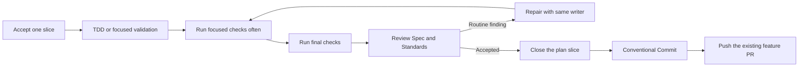

# Shape: Small composable engineering skills

## Executive summary

Replace the broad `work` and `engineering-practices` contracts with a small,
composable engineering flow.

The center is an `implement` skill adapted from Matt Pocock's engineering
skills. It takes one accepted plan slice or bounded change through this flow:

Keep the Pi-specific retained-writer and risk rules, but state them once in
`implement`. Keep TDD, diagnosis, codebase design, domain modeling, and review as
small method skills that `implement` composes.

Port only the useful parts of the upstream suite. Do not copy its issue-tracker,
setup, router, report, or interview scaffolding. Add the required MIT notice and
pin the analyzed upstream commit.

## Problem

The first quality-first harness fixed important behavior:

- one exclusive active writer lease per worktree;
- direct execution for small low-risk changes;
- one fresh retained writer for noisy or risky work;
- bug diagnosis inside the selected executor;
- same-writer routine repair through the latest returned `runId`;
- fresh Sol `high` review for non-trivial work;
- public-seam red and green evidence;
- selective QA records and targeted Playwright cleanup;
- Shape approval, Worktrunk isolation, and material-change reapproval.

The implementation is effective but too broad in two places.

1. `work` mixes route selection, model choice, leases, TDD rules, diagnosis,
   review, repair, validation, and reporting in one 78-line contract.
2. `engineering-practices` mixes reuse, DRY, cohesion, substitution, dependency
   inversion, deep modules, domain language, and trust boundaries. Other skills
   or repository instructions already own most of these concerns.

The flow also stops before a repeatable slice delivery boundary. An accepted
plan slice should not be complete after code review alone. With delivery
authority, it should produce one validated Conventional Commit and update the
existing feature pull request.

## Appetite

This is a Markdown resource, prompt, agent-contract, documentation, license,
and contract-test change. Do not add a runtime extension, service, task graph,
issue-tracker abstraction, or stacked-pull-request system.

Quality floors:

- Keep each method skill useful on its own.
- Keep orchestration in `implement`, not in every method skill.
- Keep one exclusive writer and the existing risk-based Sol profiles.
- Apply TDD at approved public seams for behavioral changes.
- Use focused before-and-after validation for refactors and non-behavioral work.
- Review every non-trivial change from a fixed point on separate Spec and
  Standards axes.
- Make one completed plan slice one validated Conventional Commit.
- Push that commit to the existing feature pull request only with explicit
  authority.
- Preserve Shape, QA, cleanup, package, and trust-boundary fixes from the first
  harness.

## Research and prior art

The audit covers all 18 directories under
[`skills/engineering`](https://github.com/mattpocock/skills/tree/8b78b531ab965735c5dc74f6f7a219e1e37326df/skills/engineering)
at upstream commit `8b78b531ab965735c5dc74f6f7a219e1e37326df`.
The upstream repository uses the MIT License with copyright held by Matt
Pocock. Substantial copied or adapted material must retain that notice.

The strongest upstream composition is
[`implement`](https://github.com/mattpocock/skills/blob/8b78b531ab965735c5dc74f6f7a219e1e37326df/skills/engineering/implement/SKILL.md):
use TDD at agreed seams, run focused tests and type checking regularly, run the
full suite at the end, run code review, then commit. Its value is the short
flow, not new implementation policy.

The audit gives these decisions:

| Upstream skill                  | Decision | Reason                                                                                                                   |
| ------------------------------- | -------- | ------------------------------------------------------------------------------------------------------------------------ |
| `implement`                     | ADAPT    | Use as the short slice state machine. Add Pi writer selection and authorized push to the existing PR.                    |
| `tdd`                           | ADAPT    | Keep its good-test, public-seam, vertical-cycle, and anti-pattern guidance.                                              |
| `code-review`                   | KEEP     | Keep the stronger local `reviewing-changes` fixed-point Spec and Standards contract.                                     |
| `codebase-design`               | ADAPT    | Add focused deep-module and testability vocabulary.                                                                      |
| `diagnosing-bugs`               | ADAPT    | Add a tighter feedback-loop, minimization, hypothesis, instrumentation, redaction, and original-scenario rerun sequence. |
| `domain-modeling`               | KEEP     | The local skill already covers terms, scenarios, code cross-references, `CONTEXT.md`, and sparing ADRs.                  |
| `prototype`                     | SKIP     | Useful standalone work, but deferred outside this implementation-flow feature.                                           |
| `resolving-merge-conflicts`     | SKIP     | Useful standalone work, but deferred because current Git skills own safe branch operations.                              |
| `wizard`                        | SKIP     | Useful for human-only setup work, but deferred because it is unrelated to plan-slice delivery.                           |
| `ask-matt`                      | SKIP     | `developing-changes` already routes Pi requests.                                                                         |
| `grill-with-docs`               | SKIP     | Shape questions and `domain-modeling` already cover this behavior.                                                       |
| `research`                      | SKIP     | The aggregate already has a researcher agent and Context Mode.                                                           |
| `setup-matt-pocock-skills`      | SKIP     | It adds issue-tracker and document scaffolding that this repository does not need.                                       |
| `to-spec`                       | SKIP     | Shape owns accepted product intent.                                                                                      |
| `to-tickets`                    | SKIP     | `planning-changes` owns vertical slices in one durable plan.                                                             |
| `triage`                        | SKIP     | This feature does not need an issue-tracker state machine.                                                               |
| `wayfinder`                     | SKIP     | Shape, plan, Todo, Git, and retained agents already provide durable state.                                               |
| `improve-codebase-architecture` | SKIP     | Its HTML report and interview flow are extra scaffolding. Reuse only `codebase-design` vocabulary.                       |

## Solution

### Small skill set

Keep these engineering skills:

- `developing-changes`: route a request without copying another skill's method;
- `implement`: deliver one accepted slice or bounded change;
- `test-driven-development`: define good tests and one vertical red-green cycle;
- `codebase-design`: define deep modules, clean seams, and public-interface
  testability;
- `diagnosing-bugs`: build a feedback loop and repair a shared root cause;
- `domain-modeling`: sharpen shared domain language with concrete scenarios;
- `reviewing-changes`: review a fixed diff on separate Spec and Standards axes.

Delete `engineering-practices`. Move its portable safeguards to focused owners:

- public-seam tests and substitution evidence move to
  `test-driven-development`;
- module depth, coherent responsibility, interface size, seams, dependency
  boundaries, and duplicated-policy evidence move to `codebase-design`;
- domain terms stay in `domain-modeling`;
- secret redaction moves to `diagnosing-bugs`;
- repository security, validation, cancellation, failure, cleanup, and trust
  checks move to `implement`;
- reuse and minimum-code guidance moves to `codebase-design` for standalone use
  and remains reinforced by the aggregate worker's `ponytail` skill.

Replace the `work` skill with `implement`. Add `/implement`. Keep `/work` only as
a compatibility prompt that invokes `implement`; do not keep a second work
method.

### Implement one slice

`implement` accepts one approved plan slice, explicit bounded request, or
confirmed bug outcome. It records the fixed point and delivery authority before
editing.

1. Inspect repository instructions, Git state, the accepted source of intent,
   public contracts, relevant tests, and required checks.
2. Select direct parent execution or one retained writer before bug diagnosis.
   Use direct execution only for sequential, low-risk, locally clear work that
   is cheap to validate.
3. For retained execution, launch one fresh worker and transfer the writer
   lease. Use Sol `medium` normally and Sol `high` for the existing high-risk
   classes. Resume the latest returned `runId` for routine repair.
4. For behavioral work, apply `test-driven-development` one vertical behavior
   at a time. For bugs, apply `diagnosing-bugs`; its minimized regression is the
   first red result. For refactors and non-behavioral work, use the smallest
   relevant before-and-after validation.
5. Run the focused test and type or static check after each coherent change.
   Run the integrated path and complete required suite once the slice is stable.
6. Send every non-trivial diff to one fresh Sol `high` reviewer. Review from the
   recorded fixed point on separate Spec and Standards axes.
7. Return routine findings to the same retained writer. Rerun affected checks
   and review material repairs. Return changed intent or architecture decisions
   to the parent or Shape before more edits.
8. After the implementation gates pass, the retained worker returns its evidence
   and exclusive writer lease to the controlling parent. The retained worker
   never edits `plan.md`, commits, or pushes.
9. The controlling parent applies Shape's closure gate and edits the slice
   checkbox. The parent then continues the `implement` delivery phase.
10. If commit and branch-update authority exists, the parent applies
    `conventional-commit`, creates one slice-scoped commit that includes the
    checkbox, pushes the current feature branch, and applies `github-cli` to
    verify the existing pull request and checks. Do not create a pull request per
    slice.
11. One slice commit is the normal case. If post-push checks find a defect, keep
    history intact. Record and deliver a separate corrective commit or plan
    slice. Do not amend through a force-push.
12. Report the outcome, changed contract, red and green evidence, checks, review,
    commit, push, pull-request state, residual risks, and any withheld delivery
    action.

If delivery authority or a companion skill is absent, stop at a verified
uncommitted state. State the missing authority or prerequisite. Do not weaken
implementation or review gates.

### TDD method

Keep the local public-seam rule and add the useful upstream distinctions:

- A good test checks observable behavior through a public interface and reads
  like a capability specification.
- Place the test at the narrowest stable seam that still proves the requested
  behavior.
- Use an independent expected value from accepted intent, a known literal, or a
  worked example.
- Run one intended red, add the minimum green behavior, then refactor while
  green before starting the next vertical behavior.
- Reject tests that only confirm mock calls, private helpers, implementation
  structure, tautological expected values, or a horizontal batch of imagined
  behavior.
- Mock only real process, filesystem, time, randomness, network, provider, or UI
  boundaries when necessary.

### Codebase design method

Use `codebase-design` only when module shape or a test seam is in question.

- Prefer a deep module: substantial behavior behind a small stable interface.
- Place a seam where callers need a stable capability, not around every class or
  function.
- Hide internal sequencing, representation, configuration defaults, and
  recoverable complexity.
- Add an adapter or injected dependency only for a real volatile or external
  boundary.
- Search the repository, standard library, native platform, and installed
  dependencies before adding a new capability.
- Extract duplication only when copies encode the same current rule and must
  change together.
- Use callers and reasons to change as evidence for one coherent module
  responsibility. File length alone is not evidence.
- Reject forwarding-only layers, duplicated policy, speculative interfaces, and
  APIs that force callers to coordinate internal steps.
- Preserve substitution through public-interface behavior tests.
- Test through the public interface. If that is difficult, treat the friction as
  evidence that the interface or seam may be wrong.

This is design vocabulary, not an automatic abstraction checklist.

### Package and attribution boundary

`@mopeyjellyfish/pi-engineering` remains an independently installable Markdown
resource package. Its focused method skills remain useful without the aggregate.
Operational delegation, retained writers, and independent agents require the
Git aggregate and `pi-subagents`.

Add the packaged third-party notice in the first slice that adds adapted
material. The notice names the pinned upstream source, Matt Pocock's copyright,
the complete MIT license, and adapted files. Include it in `package.json#files`
and packed-resource tests. Update its adapted-file list in later slices. Update
the README so it no longer claims that all guidance is original.

## Fixed decisions

- Extend `feat/quality-first-coding-harness` and PR #52.
- Keep useful local public names. Replace `work` with `implement`, but retain
  `/work` as a compatibility prompt.
- Selectively port high-value methods. Do not mirror the upstream suite.
- One completed plan slice normally produces one Conventional Commit on the
  current feature branch. A remote-check repair uses a separate corrective
  commit or slice without rewriting pushed history.
- The controlling parent, never a retained worker, closes, commits, and pushes a
  slice after the writer returns its lease and evidence.
- Push updates the existing feature pull request. Do not create one pull request
  per slice.
- Shape owns accepted intent, Worktrunk isolation, `plan.md`, slice closure, and
  material-change reapproval.
- `implement` owns execution, method composition, checks, review, repair, and
  authorized delivery for one slice.
- Keep one exclusive writer lease, fresh retained context, risk-based Sol
  profiles, same-writer repair, and fresh formal review.
- QA remains additional evidence and never replaces formal review.
- The user authorizes implementation, local commits, branch updates, and PR #52
  updates for this feature.
- Merge, release, deployment, publication, destructive cleanup, and worktree
  removal are not authorized.

## Rabbit holes

- Porting all 18 upstream skills.
- Keeping both `work` and `implement` as method skills.
- Repeating `ponytail`, TDD, domain, design, or repository rules in
  `implement`.
- Adding issue-tracker setup, ticket graphs, HTML reports, or another router.
- Adding stacked branches or one pull request per slice.
- Turning deep modules, SOLID, DRY, or Clean Code into keyword checks.
- Adding a runtime workflow engine or production service.

## No-gos

- Do not copy upstream text without the required MIT notice.
- Do not claim upstream ideas or wording as wholly original.
- Do not import upstream runtime code or depend on its repository.
- Do not add a second implementation loop beside `implement`.
- Do not commit before focused tests, final checks, and required review pass.
- Do not push without explicit authority or create a new pull request for each
  slice.
- Do not diagnose a non-trivial bug before selecting its writer.
- Do not test private implementation details or mock owned collaborators.
- Do not weaken security, accessibility, cleanup, review, or approval gates to
  keep a skill short.

## Acceptance criteria

- **AC-001 — Small composition:** The package has one `implement` orchestrator
  and focused TDD, design, diagnosis, domain, and review method skills.
- **AC-002 — No duplicate work method:** The `work` skill is removed. `/work`
  remains only as an alias prompt for `implement`.
- **AC-003 — Slice flow:** One accepted slice follows TDD or focused validation,
  frequent focused checks, final checks, fixed-point review, same-writer repair,
  slice closure, Conventional Commit, and authorized push to the existing PR.
- **AC-004 — Correct ownership:** Shape owns plan state. Implement owns one
  slice's flow. A retained worker returns the lease and evidence before the
  controlling parent closes, commits, and pushes the slice.
- **AC-005 — Correct bug route:** The executor is selected before diagnosis. A
  minimized regression check is the first red result.
- **AC-006 — TDD quality:** Tests prove public behavior with independent expected
  values and reject internal mocks, private helpers, tautologies, and horizontal
  test batches.
- **AC-007 — Design depth:** `codebase-design` supplies focused deep-module,
  seam, boundary, and testability guidance without speculative abstractions.
- **AC-008 — Removed fluff:** `engineering-practices` is removed. Its portable
  safeguards move to focused owners; repeated rules are deleted.
- **AC-009 — Preserved harness:** Writer leases, Sol risk profiles, retained
  repair, independent review, security and lifecycle checks, selective QA
  records, targeted cleanup, and material-change reapproval remain covered.
- **AC-010 — Attribution:** The package includes the pinned upstream source and
  complete MIT notice for copied or adapted material.
- **AC-011 — Package boundary:** Engineering and feature-flow remain independent
  resource packages. Operational companion requirements stay explicit.
- **AC-012 — Verified behavior:** Focused tests, standalone probes, aggregate
  reload, route probes, source and packed smoke, full checks, and final fresh
  review pass.
- **AC-013 — Delivery:** Each new plan slice is committed separately and pushed
  to PR #52 after its gates pass. The PR remains mergeable with passing checks.
