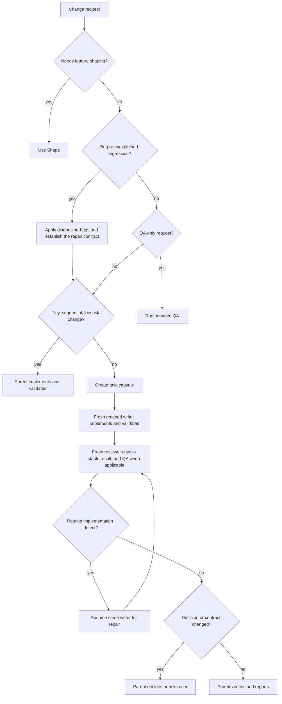

# Shape: Quality-first coding harness

## Executive summary

The installed aggregate has strong specialist agents and narrow engineering skills. It does not give the parent agent one cross-project execution contract for ordinary implementation, fixes, debugging, and QA. This gap leaves efficient worker reuse and repair routing dependent on repository-local `AGENTS.md` instructions.

Add one `developing-changes` skill and a `/develop` prompt to `@mopeyjellyfish/pi-engineering`. `/develop` requires the Git aggregate and `pi-subagents` companion install. Missing companions block the workflow with an actionable prerequisite. The skill will select the smallest suitable route. Tiny sequential changes stay with the parent agent. Noisy or multi-step implementation goes to one retained writer subagent. Fresh review or QA findings return to that writer for routine repair. The parent agent keeps requirements, decisions, review synthesis, and final verification.

Update Shape, the shared worker, and QA contracts to use the same boundaries. Do not add a runtime router, model call, task graph, or custom compaction layer.

## Problem

The aggregate already supplies these components:

- `scout`, `context-builder`, and `planner` for bounded context and planning;
- `worker` for one implementation thread;
- `qa` for repeatable user-surface validation;
- `reviewer` for independent formal review;
- `oracle` for difficult decisions;
- Shape for feature delivery;
- `diagnosing-bugs` for evidence-led root-cause work;
- Context Mode, FFF, LSP, Todo, and Worktrunk for efficient tools and isolation.

Repository-local guidance in `AGENTS.md` explains how to combine these components. That guidance affects this repository only. Other projects that install the aggregate receive the agents and skills, but they do not receive one portable parent-agent workflow for ordinary coding changes.

The current contracts also have three specific gaps:

1. Shape keeps the controlling parent agent as the sole writer. Large slice implementation, test output, and routine repair can therefore remain in the expensive parent context.
2. The QA agent requires durable `docs/qa/` plans and run reports for every assignment. This is useful for recurring QA, but it adds repository noise to one-shot validation.
3. Worker handoffs report general changes and validation, but they do not explicitly return only material knowledge changes and evidence locations. Raw operational detail can flow back into the parent context.

## Appetite

This is a focused skill-and-agent-contract change.

Quality floors:

- Keep a strong parent agent responsible for intent and final judgment.
- Keep one exclusive active writer lease for each worktree.
- Require observable validation for non-trivial logic.
- Keep fresh independent review for non-trivial changes.
- Preserve human approval for external, destructive, costly, or scope-expanding actions.
- Keep debugging evidence-led and root-cause focused.
- Keep Shape's pitch approval, vertical slices, Worktrunk isolation, and delivery gates.

Acceptable cuts:

- Use existing `pi-subagents` APIs and agent definitions instead of runtime code.
- Use deterministic resource and contract tests plus focused live acceptance. Do not build a hosted evaluation service.
- Leave advanced tool search, custom compaction, and automatic task classification to later evidence.

Stop or reshape the work if the skill requires a new production service, duplicates `pi-subagents`, weakens package independence, or cannot preserve the current review and approval gates.

## Research and prior art

OpenAI recommends lean prompts, one statement for each instruction, relevant tools only, and workload-specific evaluation. Its internal coding-agent sample found that leaner prompts improved measured evaluation scores while reducing tokens and cost, but OpenAI says to validate the result on representative tasks. See [OpenAI model guidance](https://developers.openai.com/api/docs/guides/latest-model).

OpenAI recommends multi-agent work for concrete independent workstreams and focused context. It warns that subagents can increase token use and are less useful for one ordered reasoning chain. It recommends a default maximum of three concurrent subagents for most workloads. See [OpenAI multi-agent guidance](https://developers.openai.com/api/docs/guides/responses-multi-agent).

Anthropic defines context engineering as selecting the smallest set of high-signal tokens that increases success. It recommends just-in-time retrieval, bounded tools, compaction, structured notes, and subagents that return distilled summaries. See [Anthropic context engineering](https://www.anthropic.com/engineering/effective-context-engineering-for-ai-agents).

Anthropic recommends evaluating the model and harness together with deterministic checks, model graders, and human review where each is useful. It recommends realistic tasks, trace inspection, and regression cases instead of trusting agent confidence. See [Anthropic agent evals](https://www.anthropic.com/engineering/demystifying-evals-for-ai-agents).

Anthropic's long-running harness work uses incremental progress, Git and progress artifacts, one coherent feature at a time, and real end-to-end validation. It also states that the best boundary between one general agent and specialized agents remains workload-dependent. See [Anthropic long-running harnesses](https://www.anthropic.com/engineering/effective-harnesses-for-long-running-agents).

The repository already implements most of this prior art. The chosen direction adds the missing portable orchestration contract. It does not replace existing tools or add another workflow engine.

## Solution

### Cross-project entry

Add `developing-changes` to `@mopeyjellyfish/pi-engineering`.

Its description will match requests to implement, fix, debug, validate, or QA code. Add `/develop [change request]` as an explicit entry point. Keep `/shape` for a feature that needs shaping and human pitch approval. Keep `/diagnose` as the focused bug entry point.

The package remains independently installable for its narrow skills. Its README must state that `/develop` additionally requires the Git aggregate agent set and `pi-subagents`. If either companion is unavailable, stop with the exact install prerequisite. Do not silently degrade a promised independent quality gate.

The skill will route work by evidence and context shape:

A tiny direct change must be sequential, low-risk, locally understandable, and cheap to validate. File count alone does not decide the route. Noisy discovery, long tests, repeated repair, broad context, or material risk moves work to a retained writer or a specialist.

### Parent and writer boundaries

The parent agent owns:

- the user conversation and clarification;
- scope, acceptance criteria, and authority;
- product, architecture, security, and risk decisions;
- task-capsule synthesis;
- reviewer and QA finding synthesis;
- final diff inspection and verification;
- commit, push, pull-request, merge, release, and cleanup authority.

One writer subagent owns:

- implementation within the approved task capsule;
- focused tests and static checks;
- routine debugging and repair;
- concise evidence and residual-risk reporting.

For substantial or noisy work, launch the writer with fresh context and a self-contained capsule. Continue that retained run for routine repairs. Do not start a new writer for each failed test. Start a fresh writer only when the old context is contradictory, repeatedly failing, unavailable, or based on an invalidated contract.

### Review and QA boundaries

Use a fresh formal reviewer for non-trivial implemented changes. QA evidence does not replace formal review.

A one-shot QA request returns concise evidence and artifact paths through its result. It does not write `docs/qa/` by default. Require durable QA plans and run reports when the user requests them, when the test plan will recur, or when comparable historical evidence is part of the task.

If QA or review finds a routine implementation defect, the parent synthesizes the finding and resumes the same writer. If evidence changes intent, architecture, ownership, security, risk, or scope, the writer stops and the parent decides or asks the user.

### Material-delta handoffs

Writer and QA handoffs must make the next decision easy. Return:

- outcome and changed files;
- changed contracts or facts;
- invalidated assumptions;
- commands and checks with results;
- exact artifact or evidence locations;
- residual risks;
- decisions required from the parent.

Do not paste raw logs, large diffs, or repeated task instructions into the parent context. Keep full operational output in the retained run or an artifact.

### Shape integration

Keep the controlling Shape agent as the parent and sole decision-maker. Use one exclusive active writer lease for the worktree. During shaping, the parent owns the lease and writes the pitch and plan. For a non-tiny slice, the parent transfers the lease to one retained writer. That writer owns all slice edits, including code, tests, documentation, checkbox updates, and blocked notes directed by the parent. The parent reads load-bearing sources, synthesizes reviews, and verifies without editing while the worker holds the lease. If intent changes materially, pause the worker and return the lease to the parent. Set the pitch to draft, update the pitch and affected plan, repeat independent pitch review, and present the complete revised pitch for human approval. Transfer the lease back only after the pitch is accepted again.

### Evaluation and evidence

Add deterministic tests that verify:

- the new skill and prompt are packaged and discoverable;
- the route contract distinguishes feature, bug, QA, tiny direct, and retained-writer work;
- the parent remains the decision authority;
- routine defects return to the same writer;
- review stays fresh and independent;
- one-shot QA does not require repository documentation;
- material-delta handoffs and artifact paths are required;
- Luna is not the default implementation route.

Run focused package tests, `npm run smoke:source`, and `npm run check`. Exercise the aggregate in a deterministic Pi session and verify the new skill and prompts load without conflict. Run the focused automated test before `/reload`, reload while Pi is idle, then exercise the changed resources and confirm the new behavior without duplicate registrations or stale state. Run five focused live scenarios: Shape, debug, one-shot QA, tiny direct work, and noisy or multi-step retained-writer work. Run `npm run smoke:source` after the reload loop. Record observed route, agent model, review behavior, context or token totals when available, and any quality failures. Treat lower cost or token use as an improvement only when the same acceptance checks pass.

## Fixed decisions

- The skill activates through natural task matching and `/develop`.
- `/develop` requires the Git aggregate agent set and `pi-subagents`; missing companions block the workflow.
- Routing is adaptive and quality-first.
- Tiny sequential low-risk work can stay with the parent agent.
- Noisy or multi-step implementation uses one retained writer.
- The configured normal writer remains Sol `medium`; Luna is not the default implementation model.
- Luna remains suitable for bounded discovery and repeatable low-risk QA.
- One-shot QA stays ephemeral unless durable records are explicit or reusable.
- Fresh formal review remains required for non-trivial implementation.
- The parent agent retains all product, architecture, security, scope, synthesis, and final-verification authority.
- Each worktree has one exclusive active writer lease. The parent and retained writer transfer that lease explicitly and never edit concurrently.
- The feature branch is `feat/quality-first-coding-harness` from `origin/main` at `7fcade46d5b63b9687032393b18bf27b64dc085e`.
- The user authorizes implementation, local commits, branch push, and opening a pull request for this feature.
- Merge, release, deployment, publication, destructive cleanup, and worktree removal are not authorized.

Implementation details that remain open to agent judgment:

- exact skill section names and wording;
- whether `/qa` is a separate prompt or a documented `/develop` route, provided QA is discoverable;
- exact deterministic contract-test structure;
- whether a tiny Shape slice stays in the parent or always uses the retained writer, provided the route remains explicit and testable.

## Rabbit holes

- **Automatic router extension:** Prompt interception or a router-model call adds latency, hidden policy, and a new failure mode. Use skill matching and explicit prompts.
- **Another task graph:** `pi-subagents`, Shape, Todo, and missions already provide orchestration and durable state.
- **Custom compaction:** Pi already has structured compaction, and Context Mode keeps large output out of the main context.
- **Dynamic tool loader:** Pi supports deferred tools, but changing the active tool catalog can affect interoperability and prompt caching. Evaluate it separately if tool-schema cost becomes a measured problem.
- **Agent swarm:** Start with one agent. Add independent read-only lanes only when a distinct evidence need justifies them.
- **Universal cheap worker:** Cost is secondary to quality. Keep risk-based model selection.
- **New QA service:** Reuse the existing QA agent and public test surfaces.
- **Large evaluation platform:** Add focused contract tests and live acceptance first. Expand only when repeated harness changes need statistical comparison.

## No-gos

- Do not add a new production runtime extension for routing.
- Do not install or bundle another orchestration framework.
- Do not make Luna the normal implementation model.
- Do not permit simultaneous or ambiguous write ownership in one worktree.
- Do not let a reviewer or QA agent silently make product or architecture decisions.
- Do not let automatic closure mutate Git or GitHub state.
- Do not require `docs/qa/` changes for one-shot QA.
- Do not claim efficiency gains without equal-or-better acceptance evidence.
- Do not weaken tests, review, security, accessibility, or approval boundaries to reduce tokens or cost.

## Acceptance criteria

- **AC-001 — Portable workflow:** The full Git aggregate plus `pi-subagents` exposes a discoverable coding workflow for implementation, fixes, debugging, and QA through `@mopeyjellyfish/pi-engineering` resources.
- **AC-002 — Explicit entry:** `/develop [change request]` loads the portable workflow without repository-local `AGENTS.md` guidance and reports an actionable blocked prerequisite when a required companion is absent.
- **AC-003 — Adaptive route:** The workflow keeps tiny sequential low-risk changes direct and assigns noisy or multi-step implementation to one retained writer.
- **AC-004 — Feature route:** Work that needs feature shaping routes to Shape, preserves pitch approval, Worktrunk isolation, vertical slices, and delivery gates, and uses one explicit active writer lease.
- **AC-005 — Debug route:** Bug work preserves observable reproduction, shared-root-cause tracing, one durable regression check, the adaptive implementation route, and normal review and verification gates.
- **AC-006 — QA route:** One-shot QA returns evidence without mandatory repository files. Recurring or explicitly documented QA keeps reusable plans and comparable run reports.
- **AC-007 — Repair locality:** Routine review, test, or QA defects return to the same retained writer. Decision-level findings return to the parent agent.
- **AC-008 — Independent quality gate:** Non-trivial implementation receives a fresh formal review, and QA does not replace that review.
- **AC-009 — Material handoff:** Worker and QA results contain decision-relevant deltas, validation results, evidence paths, residual risks, and required decisions without raw-log dumps.
- **AC-010 — Quality-first models:** Normal implementation uses the configured Sol worker. Faster models are limited to bounded work with deterministic checks.
- **AC-011 — Lean composition:** The implementation reuses current agents, skills, prompts, artifacts, and `pi-subagents` controls without adding a routing runtime or duplicate task graph.
- **AC-012 — Verified package:** Focused tests, `npm run smoke:source`, and `npm run check` pass from the final worktree.
- **AC-013 — Live aggregate acceptance:** A deterministic Pi source session passes the focused test, reloads while idle, loads the new and changed resources without duplicate registrations or stale state, and demonstrates the five route classes before `npm run smoke:source`.
- **AC-014 — Delivery:** The work is committed with a valid Conventional Commit, pushed, and opened as a pull request with checks and residual risks stated.
