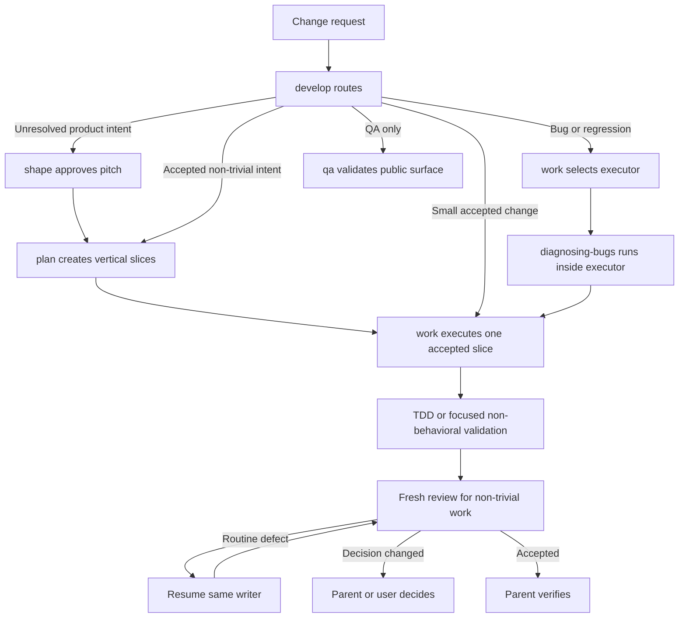

# Shape: Quality-first coding harness

## Executive summary

The aggregate has strong specialist agents and focused engineering skills. It
still lacks one cohesive path from unresolved intent to verified code. The
first implementation added useful writer, repair, review, QA, and context
boundaries. It also copied the execution contract into Shape and selected the
bug executor too late.

Keep those fixes and make the workflow composable. Add first-party `plan` and
`work` skills. Keep `developing-changes` as the adaptive entry and router.
Shape owns product intent. Plan turns accepted intent into vertical slices.
Work becomes the only implementation contract for planned slices, bugs, and
small fixes.

Add focused `test-driven-development` and `engineering-practices` skills. Every
behavioral code change must show one public-seam test fail for the intended
reason before the minimum implementation makes it pass. Design guidance must
use evidence, not DRY, SOLID, Clean Code, or deep-module slogans.

Flywheel, Superpowers, BigPowers, and other workflow frameworks are excluded.
The solution uses only this repository's packages and the existing
`pi-subagents` companion.

## Problem

The aggregate already supplies:

- Shape for product shaping, worktree isolation, planning, and feature delivery;
- `diagnosing-bugs` for evidence-led root-cause work;
- `reviewing-changes` for independent fixed-point review;
- `domain-modeling` for shared language and concrete scenarios;
- `worker`, `qa`, `reviewer`, `planner`, and other bounded agent roles;
- Context Mode, FFF, LSP, Todo, and Worktrunk for tools and isolation.

The first harness slice fixed several real problems:

- Shape can transfer one exclusive writer lease to a retained worker.
- Routine repair resumes the same worker and uses its latest returned `runId`.
- A material intent change invalidates the old writer context.
- One-shot QA no longer creates durable repository records by default.
- Worker and QA handoffs return material deltas instead of raw operational
  output.
- QA remains separate from formal review.
- Delegated-agent artifacts are excluded from repository tooling.

Four design gaps remain.

1. Shape and `developing-changes` independently specify direct work, retained
   work, review, and repair. The two contracts can drift.
2. The bug route applies `diagnosing-bugs` through diagnosis and repair before
   it selects the direct parent or retained writer. This can violate the writer
   lease and repeat work.
3. Shape asks for a small behavior-focused test, but the workflow does not prove
   an intended red result before production code.
4. The workflow names quality principles but does not turn them into observable
   implementation and review evidence.

Production resources, manifests, prompts, agent contracts, tests, and imports
contain no Flywheel, Superpowers, or BigPowers integration. Feature documents
can name them only to record this exclusion.

## Appetite

This remains a skill, prompt, agent-contract, documentation, and test change.

Quality floors:

- Keep a strong parent responsible for intent and final judgment.
- Keep one exclusive active writer lease for each worktree.
- Use one canonical implementation contract for planned and unplanned work.
- Require public-seam red and green evidence for every behavioral code change.
- Require a focused validation for non-behavioral changes.
- Keep fresh independent review for non-trivial implementation.
- Preserve human approval for product intent and external, destructive, costly,
  or scope-expanding actions.
- Keep bug work evidence-led and root-cause focused.
- Keep Shape's pitch approval and Worktrunk boundaries.
- Keep each production package independently installable for its stated scope.

Acceptable cuts:

- Use Markdown skills and prompts instead of a runtime router.
- Use deterministic contract tests and focused live acceptance instead of an
  evaluation service.
- Keep feature-flow and engineering independently publishable and installable.
  Require the aggregate tools and `pi-subagents` companion when their workflows
  run.
- Apply TDD to behavioral code. Use existing-test and focused-validation gates
  for pure refactors, documentation, metadata, and mechanical changes. Do not
  manufacture meaningless tests.

Stop or reshape the work if it requires another orchestration framework,
duplicates `pi-subagents`, adds a production service, weakens package
boundaries, or turns design principles into unconditional abstraction rules.

## Research and prior art

OpenAI recommends lean prompts, relevant tools only, and workload-specific
evaluation. It warns that subagents add cost and are most useful for concrete,
independent work or focused context. See
[OpenAI model guidance](https://developers.openai.com/api/docs/guides/latest-model)
and
[OpenAI multi-agent guidance](https://developers.openai.com/api/docs/guides/responses-multi-agent).

Anthropic recommends selecting a small set of high-signal context, using
bounded tools, and returning distilled subagent results. It also recommends
realistic evaluations, trace inspection, incremental progress, and real
end-to-end validation. See
[Anthropic context engineering](https://www.anthropic.com/engineering/effective-context-engineering-for-ai-agents),
[Anthropic agent evals](https://www.anthropic.com/engineering/demystifying-evals-for-ai-agents),
and
[Anthropic long-running harnesses](https://www.anthropic.com/engineering/effective-harnesses-for-long-running-agents).

Matt Pocock's current TDD skill centers tests on confirmed public seams. It uses
one failing test followed by the minimum passing implementation. It rejects
horizontal test batches, internal mocks, implementation-coupled tests, and
expected values derived from the implementation itself. See
[the referenced TDD skill](https://github.com/mattpocock/skills/blob/main/skills/engineering/tdd/SKILL.md).

DRY, SOLID, Clean Code, and John Ousterhout's deep-module guidance can conflict
when used as slogans. For example, speculative interfaces can satisfy an
abstract reading of dependency inversion while adding shallow indirection. The
chosen direction asks for concrete evidence about shared policy, callers,
public seams, volatility, and interface depth.

## Solution

### First-party skill system

Use this repository's skills as one staged system:

The skills have narrow responsibilities:

- `developing-changes` classifies and routes. It does not copy the work loop.
- `shape` resolves product intent, owns Worktrunk and pitch approval, and hands
  accepted intent to plan.
- `plan` creates the smallest ordered vertical slices. It names public seams,
  behavior, validation, and done conditions. It does not implement.
- `work` executes one accepted slice or bounded change. It owns direct versus
  retained execution, writer-lease transfer, model risk, TDD, validation,
  review, and routine repair.
- `diagnosing-bugs` runs inside the selected executor. Its reproduction or
  regression check becomes the first red test.
- `test-driven-development` defines only the public-seam red and green method.
  It contains no routing or subagent policy.
- `engineering-practices` defines evidence-based design constraints. It
  contains no routing or subagent policy.
- `reviewing-changes` and the reviewer apply a fresh fixed-point quality gate.
- `qa` supplies public-surface evidence and does not replace review.

Add `/plan` and `/work` prompts for explicit use. Keep `/shape`, `/develop`, and
`/diagnose`. Natural skill matching remains available.

### Package boundary

`@mopeyjellyfish/pi-feature-flow` owns Shape and plan.
`@mopeyjellyfish/pi-engineering` owns develop, work, TDD, engineering
practices, diagnosis, domain modeling, and review. Both packages remain
independently publishable and installable Markdown-resource packages. They do
not import another workspace or claim that installation alone supplies host
tools.

The operational workflows require the Git aggregate tools and the separately
installed `pi-subagents` companion. At activation, Shape, plan, develop, and
work check the tools, skills, and agents that their next gate needs. If a
required companion is unavailable, stop with actionable install guidance. A
standalone package probe verifies resource discovery and this blocked behavior.
It does not claim a complete standalone workflow. Do not copy a missing
companion's contract into another skill.

### Canonical work contract

Work accepts an approved slice, explicit bounded request, or confirmed bug
outcome. It first checks repository instructions, current Git state, public
contracts, and authority.

Work keeps execution in the parent only when the change is sequential,
low-risk, locally understandable, and cheap to validate. Otherwise it creates a
self-contained task capsule, launches one fresh retained worker, and transfers
the exclusive writer lease.

Use Sol `medium` for normal retained implementation. Use Sol `high` for
security, data loss, concurrency, lifecycle, migration, public API, protocol,
provider transport, cross-package architecture, nondeterministic behavior, and
expensive or unclear validation. Luna is not the default implementation route.

For a bug, select the executor before applying `diagnosing-bugs`. The selected
executor owns reproduction, caller and sibling tracing, root-cause repair, and
the regression test. Do not diagnose and fix in the parent before assigning a
retained writer.

Use one fresh Sol `high` reviewer for every non-trivial implementation. Resume
the latest retained writer `runId` for a routine implementation defect. Start a
fresh writer only when retained context is unavailable, contradictory,
repeatedly failing, or invalidated by a changed contract.

A decision-level finding returns the writer lease to the parent. Shape then
uses its full material-change gate when accepted feature intent changes.

### Test-driven development

Apply the TDD skill to every behavioral code change:

1. Name one observable behavior and its public seam.
2. Treat an explicit accepted request, accepted pitch, or accepted plan as seam
   approval. Ask the user only when the seam is unresolved.
3. Add the smallest behavior test at that seam.
4. Run the test and confirm that it fails for the intended behavioral reason.
5. Add only the production behavior needed to pass that test.
6. Run the focused test and confirm green.
7. Repeat vertically for the next behavior.
8. Run the applicable integrated path and required checks before completion.

Mock only real process, filesystem, time, randomness, network, provider, or UI
boundaries when necessary. Do not mock owned modules or test private helpers.
Use an independent expected value from the specification, a known literal, or a
worked example.

A pure refactor uses applicable existing tests or the smallest focused
validation before and after the change. Add a missing public-seam behavior test
when it provides material protection, not as mandatory ceremony.
Documentation, metadata, generated-contract, and mechanical changes use the
smallest focused validation that can detect the intended error.

### Engineering practices

The engineering-practices skill turns design principles into evidence:

- Search for an existing repository helper, standard-library feature, native
  platform feature, or installed dependency before adding code.
- Extract duplication only when it represents the same current rule and its
  copies must change together. Similar syntax is not enough.
- Give a module one coherent policy or capability. Use callers and reasons to
  change as evidence. Do not use file length as the test.
- Preserve substitution through public-seam behavior tests. Do not add an
  interface for one implementation or a speculative variant.
- Add dependency injection only at a real volatile or external boundary.
  Prefer an existing seam.
- Prefer a small public interface that hides substantial behavior. Reject
  forwarding-only layers and APIs that expose internal sequencing.
- Use terms from the nearest `CONTEXT.md`. Keep validation, cancellation,
  failures, cleanup, and trust boundaries explicit.
- Report a principle violation only with a concrete duplicated rule, shallow
  layer, broken public contract, unstable dependency, or unnecessary exported
  concept.

The worker applies these rules during implementation. The reviewer checks the
same evidence after behavior is stable. Tool-enforced formatting, linting, and
coverage remain tooling concerns, not review prose.

### Preserve efficiency and bug fixes

Keep these first-slice changes:

- one exclusive writer lease and explicit lease transfer;
- fresh initial writer context;
- same-writer routine repair with the latest returned `runId`;
- fresh writer context after a material intent change;
- material-delta worker and QA handoffs;
- one-shot QA without default `docs/qa/` records;
- QA as evidence, not formal review;
- current Playwright workspace-scoped targeted cleanup safeguards;
- `.pi/subagents/` exclusions from repository tooling;
- final parent diff inspection, verification, and delivery authority.

## Fixed decisions

- All workflow skills are first-party resources in this repository.
- Flywheel, Superpowers, BigPowers, and other workflow frameworks are excluded.
- The staged route is develop to Shape or plan to work.
- Feature-flow owns Shape and plan. Engineering owns develop, work, TDD, and
  engineering practices.
- `/develop` remains the adaptive entry. `/plan` and `/work` are explicit
  entries.
- Shape plans use the canonical work contract. Shape does not copy it.
- The executor is selected before full bug diagnosis and repair.
- Every behavioral code change requires intended red and green evidence at a
  public seam.
- Accepted intent counts as seam approval. Ask only when the seam is unresolved.
- Pure refactors and non-behavioral changes use applicable existing tests or a
  focused validation instead of a manufactured failing test.
- Design rules require concrete evidence. Acronym-only findings are invalid.
- Tiny sequential low-risk work can stay with the parent and follows the same
  TDD and engineering-practices contract.
- Non-trivial or noisy work uses one retained writer and fresh formal review.
- The worker uses Sol `medium` normally and Sol `high` for repository-defined
  high-risk work.
- One-shot QA stays ephemeral unless records are requested, reusable, or needed
  for historical comparison.
- Each worktree has one exclusive active writer lease.
- The parent retains product, architecture, security, scope, synthesis, final
  verification, and delivery authority.
- The branch is `feat/quality-first-coding-harness` against current
  `origin/main`.
- The user authorizes implementation, local commits, branch updates, and PR #52
  updates for this feature.
- Merge, release, deployment, publication, destructive cleanup, and worktree
  removal are not authorized.

Implementation details left to agent judgment:

- exact internal headings and prompt wording;
- whether plan uses a retained planner for a specific high-complexity request;
- the minimum live probe needed to prove each composed route;
- exact deterministic contract-test structure.

## Rabbit holes

- **External skill systems:** Do not copy or package Flywheel, Superpowers,
  BigPowers, or another workflow framework.
- **Runtime router:** Skill matching and explicit prompts are sufficient.
- **Acronym linter:** DRY, SOLID, Clean Code, and deep modules need judgment and
  evidence. Do not turn them into keyword scoring.
- **Universal abstraction layer:** Do not add interfaces, factories, or
  dependency injection without current variation or a volatile boundary.
- **Test ceremony:** Do not create tautological tests or tests for Markdown
  wording that a focused validator already checks.
- **Another task graph:** Shape plans, Todo, Git, and `pi-subagents` already
  provide state.
- **Custom compaction:** Pi and Context Mode already provide bounded context
  mechanisms.
- **Agent swarm:** Start with one agent. Add read-only specialists only for a
  distinct evidence need.
- **Universal cheap worker:** Keep risk-based model selection.
- **New QA or evaluation service:** Use existing QA and deterministic checks.

## No-gos

- Do not add, copy, reference, package, or load Flywheel, Superpowers, or
  BigPowers resources.
- Do not add a production runtime extension for routing.
- Do not duplicate the canonical work loop in Shape, plan, develop, or TDD.
- Do not select a writer after the parent has already completed a non-trivial
  bug repair.
- Do not write production behavior before the intended red result.
- Do not test private implementation details or mock owned collaborators.
- Do not add speculative abstractions to satisfy a principle by name.
- Do not make Luna the normal implementation model.
- Do not permit simultaneous or ambiguous write ownership.
- Do not let QA replace formal review.
- Do not require durable repository records for one-shot QA.
- Do not weaken tests, security, accessibility, lifecycle cleanup, review, or
  approval gates for speed.

## Acceptance criteria

- **AC-001 — First-party workflow:** Production resources, manifests, prompts,
  agent contracts, tests, and imports use only this repository's Shape, plan,
  develop, work, TDD, diagnosis, QA, and review contracts. They do not copy,
  package, load, or integrate Flywheel, Superpowers, or BigPowers.
- **AC-002 — Explicit entries:** `/shape`, `/plan`, `/develop`, `/work`, and
  `/diagnose` load their focused first-party contracts.
- **AC-003 — Cohesive route:** Develop routes unresolved product intent to
  Shape, accepted non-trivial intent to plan, accepted slices and small fixes to
  work, bugs to work with diagnosis, and QA-only requests to QA.
- **AC-004 — Canonical work:** Shape and plan hand accepted slices to one work
  contract. They do not copy direct, retained-writer, review, or repair policy.
- **AC-005 — Package boundary:** Feature-flow and engineering remain
  independently publishable and installable resource packages. Their
  operational workflows check and report actionable aggregate and
  `pi-subagents` prerequisites instead of claiming standalone execution.
- **AC-006 — Correct bug ownership:** Work selects the direct parent or retained
  writer before the selected executor applies diagnosis and repair.
- **AC-007 — TDD evidence:** Every behavioral code change records a public-seam
  test that failed for the intended reason before the minimum implementation
  made it pass.
- **AC-008 — Non-behavioral evidence:** Pure refactors use applicable existing
  tests or focused validation before and after. Documentation, metadata, and
  mechanical changes use a focused error-detecting validation.
- **AC-009 — Practical design:** Worker and reviewer contracts apply
  evidence-based reuse, DRY, cohesion, substitution, dependency, interface
  depth, naming, failure, and cleanup rules without speculative abstractions.
- **AC-010 — Adaptive execution:** Tiny sequential low-risk work remains direct.
  Noisy, risky, or multi-step work uses one fresh retained writer.
- **AC-011 — Risk profile:** Retained work uses Sol `medium` normally and Sol
  `high` for the repository-defined high-risk classes.
- **AC-012 — Repair locality:** Routine defects return to the latest retained
  writer `runId`. Invalidated contracts launch a fresh writer.
- **AC-013 — Independent quality gate:** Every non-trivial implementation gets a
  fresh Sol `high` review. QA never replaces review.
- **AC-014 — Efficient evidence:** Worker and QA handoffs contain material
  deltas, checks, evidence paths, residual risks, and decisions without raw-log
  dumps.
- **AC-015 — Selective QA records:** One-shot QA creates no `docs/qa/` records.
  Requested, recurring, or comparative QA can keep durable evidence.
- **AC-016 — Preserved cleanup:** QA retains current workspace-scoped,
  targeted Playwright cleanup and never uses global `kill-all` cleanup.
- **AC-017 — Preserved Shape gates:** Shape keeps Worktrunk isolation, full
  pitch approval, vertical plans, the worktree-wide lease invariant, and
  material-change reapproval. Work owns implementation-worker selection and
  lease transfer.
- **AC-018 — Verified packages:** Focused tests, source and packed smoke tests,
  `npm run check`, and package boundary checks pass from the final worktree.
- **AC-019 — Live composition:** A deterministic Pi session reloads without
  duplicate resources and demonstrates Shape to plan to work, direct small
  work, retained bug work, routine retained repair, and one-shot QA.
- **AC-020 — Delivery:** Valid Conventional Commits update the authorized branch
  and PR #52 with checks, live evidence, and residual risks.
