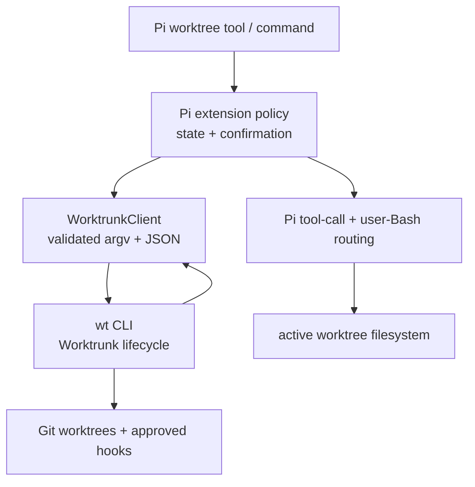

## Overview

Replace the unmerged `@mopeyjellyfish/pi-git` worktree implementation with
`@mopeyjellyfish/pi-worktrunk`. The Pi package will remain a small, local
adapter: it provides a safe agent tool and persistent active-worktree routing.
Worktrunk (`wt`) becomes the sole owner of worktree creation, selection, path
templates, hooks, and cleanup.

This is a pre-merge refactor, not a compatibility migration: the current
`packages/git/` package is untracked and at version `0.0.0`, so no released
package name, tool contract, or managed-directory layout needs preserving.

## Problem Frame

The pending `pi-git` package reimplements Git worktree creation, deterministic
storage, pruning, deletion checks, and lifecycle state. Worktrunk already owns
that domain and adds configurable paths, branch/PR selection, hook approval,
and parallel-agent workflows. Maintaining both as independent lifecycle
managers would create conflicting worktree semantics and duplicated safety
logic.

Pi still needs behavior Worktrunk cannot supply on its own: a session-local
active worktree, transparent routing of Pi's file/Bash tools, session-state
restoration, non-interactive-mode behavior, output bounds, and Pi-native user
confirmation.

## Requirements Trace

- R1. Determine whether an official Worktrunk Pi extension already exists.
- R2. If it does not, provide a plan for a Pi extension that uses Worktrunk for
  agent tool usage and includes a skill where it materially improves safe use.
- R3. Decide whether to add a separate package or replace the pending Git
  worktree package.
- R4. Preserve Pi extension constraints: cancellation propagation, lifecycle
  cleanup, output truncation, non-interactive safety, and no production stdout.
- R5. Preserve repository package independence and synchronized release
  metadata.

## Scope Boundaries

- Do not add a JavaScript dependency on Worktrunk or install its binary during
  package installation. `wt` is a user-managed executable on `PATH`.
- Do not expose Worktrunk's commit, merge, rebase, push, PR, or arbitrary-hook
  execution workflows as Pi tools.
- Do not auto-edit `~/.config/worktrunk/config.toml`, approve Worktrunk hooks,
  run `wt config approvals add`, or pass `--yes` for a hook-bearing action. A
  UI-confirmed removal may use it only together with `--no-hooks`, solely to
  suppress Worktrunk's own non-interactive removal prompt.
- Do not retain a second `@mopeyjellyfish/pi-git` package after this refactor.
- Do not import, vendor, or depend on either third-party Pi implementation;
  they are prior art only.
- Do not treat routed tools as a filesystem sandbox or attempt to parse and
  rewrite arbitrary shell syntax. Relative paths and paths rooted in Pi's main
  repository are remapped; unrelated absolute paths retain Pi's normal
  behavior.
- Do not relocate Pi's session/current working directory in v1. The adapter
  routes tools while retaining the current session and its resource index.
- Do not spawn a nested Pi process from the extension. Worktrunk's `-x pi`
  launch flow remains an explicit, user-owned alternative when a fully native
  worktree-rooted Pi session is preferred.

### Deferred to Separate Tasks

- Worktrunk merge/commit/rebase orchestration: leave to direct, explicitly
  approved user workflows or a future separately scoped extension.
- Automatic installation and version management of `wt`: leave to Worktrunk's
  supported installers and future packaging work if needed.
- A full mirror of Worktrunk's upstream documentation/reference skill: defer
  unless users demonstrate that the focused Pi skill is insufficient.
- A user-invoked, UI-confirmed session-relocation command: Pi's
  `SessionManager.forkFrom()` can move conversation history into a target
  worktree, but it also creates/replaces session files and changes resource
  discovery semantics. Evaluate it separately after the transparent-routing
  package is proven useful.
- A native agent-Bash cwd override: defer unless Pi exposes a public decorator
  for its configured built-in Bash tool. `createBashTool` can create a new
  tool, but cannot inherit Pi's configured `shellPath` and
  `shellCommandPrefix`; replacing the built-in would regress those settings.

## Context & Research

### Relevant Code and Patterns

- `packages/git/src/index.ts` already registers one strict `worktree` tool,
  persists session state, routes built-in file and Bash tools, and guards TUI
  behavior.
- `packages/git/src/routing.ts` contains the reusable, well-tested mapping from
  Pi's original repository root to an active worktree. Retain this behavior;
  it is the Pi-specific value Worktrunk does not provide.
- `packages/git/src/worktrees.ts` and `packages/git/src/git.ts` implement the
  direct-Git lifecycle to remove. Their safety invariants become preconditions
  in the Worktrunk adapter instead of a parallel worktree manager.
- `packages/git/test/index.test.ts`, `packages/git/test/routing.test.ts`, and
  the Git-backed fixtures establish the current extension testing idioms.
- `docs/architecture.md` requires independently installable packages, bounded
  factories, session lifecycle cleanup, cancellation propagation, output
  truncation, and correct non-TUI behavior.
- The repository's installed Pi baseline (`@earendil-works/pi-coding-agent`
  `0.80.6`) exposes the exact primitives this adapter needs: mutable
  `tool_call` inputs for path routing, `createLocalBashOperations()` for user
  Bash, per-tool `executionMode: "sequential"`, `ctx.abort()`, session custom
  entries, and lifecycle restoration. `ctx.cwd` itself is not mutable.
  `createBashTool(..., { spawnHook })` exists, but is a new Bash definition;
  the extension API does not expose the configured built-in `shellPath` or
  `shellCommandPrefix` needed to replace it without regression.
- Pi's `SessionManager.forkFrom()` can create a replacement session rooted in a
  different worktree. Published `@ogulcancelik/pi-worktree` proves this is
  technically viable, but it forks and deletes session files after an explicit
  user command. It is deliberately outside this first adapter's routing-only
  session model.
- Published `@rezamonangg/pi-worktree` independently validates Pi's path and
  Bash-routing seams, including a `createBashTool` spawn-hook override. Its
  direct Git lifecycle, heuristic auto-start, repository disk state, broad
  commit/rebase surface, and Bash-setting tradeoff are intentionally not
  adopted.
- Published `@season179/pi-worktree` validates a flag-driven temporary
  worktree UX, but it owns direct Git lifecycle and terminal-time deletion;
  Worktrunk remains the lifecycle authority here.
- No matching `docs/research/`, `docs/solutions/`, `docs/context/`, or
  `docs/decisions/` artifact exists. A separate ADR is not warranted: this
  unreleased package decision is fully captured by this plan and is still
  inexpensive to reverse.

### External References

- Worktrunk's [official repository and CLI overview](https://github.com/max-sixty/worktrunk)
  document `wt switch`, `wt list`, `wt remove`, path templates, hooks, and its
  parallel-agent focus.
- `wt switch --no-cd --format=json` has an
  [official structured result](https://github.com/max-sixty/worktrunk/blob/main/src/commands/worktree/switch.rs)
  intended for tool integration. The adapter will use its absolute `path` only
  after validating it against a fresh list result.
- Worktrunk's [schema-2 list contract](https://github.com/max-sixty/worktrunk/blob/main/src/commands/list/json_v2.rs)
  is explicitly selected per invocation with
  `--config-set list.json-schema=2`; this avoids inheriting a user's legacy
  schema-1 default during the upstream migration.
- Worktrunk ships an official [Codex plugin manifest](https://github.com/max-sixty/worktrunk/blob/main/plugins/worktrunk/.codex-plugin/plugin.json)
  and [generic Agent Skill](https://github.com/max-sixty/worktrunk/blob/main/skills/worktrunk/SKILL.md),
  but its repository has no Pi package manifest or Pi extension. Pi's
  [package](https://pi.dev/docs/packages) and [skill](https://pi.dev/docs/skills)
  documentation confirms that a Pi package can bundle a TypeScript extension
  and Agent Skills.
- Pi's [extension documentation](https://github.com/earendil-works/pi/blob/main/packages/coding-agent/docs/extensions.md)
  documents mutable `tool_call` inputs, `user_bash`, lifecycle restoration,
  output truncation, custom-tool execution modes, and `createBashTool` spawn
  hooks. Its [session API documentation](https://github.com/earendil-works/pi/blob/main/packages/coding-agent/docs/session-format.md)
  documents `SessionManager.forkFrom()` as an explicit cross-project session
  operation rather than a mutable `cwd` setter.
- Published non-official prior art exists:
  [`pi-worktrunk`](https://www.npmjs.com/package/pi-worktrunk) only maps Pi
  lifecycle events to Worktrunk activity markers, while
  [`@carter-mcalister/pi-worktrunk`](https://www.npmjs.com/package/@carter-mcalister/pi-worktrunk)
  wraps selected `wt` commands. Neither is published by Worktrunk's
  `max-sixty` organization, and neither provides the pending package's
  transparent Pi tool routing.
- Other representative non-official Pi worktree packages are
  [`@rezamonangg/pi-worktree`](https://github.com/rezamonangg/pi-worktree),
  [`@ogulcancelik/pi-worktree`](https://github.com/ogulcancelik/pi-extensions),
  [`@pandi-coding-agent/pandi-worktree`](https://github.com/andrestobelem/pandi-extensions/tree/main/extensions/pandi-worktree),
  and [`@season179/pi-worktree`](https://www.npmjs.com/package/@season179/pi-worktree).
  They are implementation patterns, not compatibility targets or authorities.

### Research Finding

There is **no official Worktrunk-owned Pi extension** as of 2026-07-10. The
upstream project does provide first-party Codex/Claude/Gemini integrations and
standard Agent Skills, so the proposed Pi package should follow those concepts
while using Pi's own extension and lifecycle APIs.

Pi can route a tool process to a selected worktree, but it cannot mutate the
current session's `cwd` in place. Transparent routing is therefore the correct
v1 default: it preserves conversation/session ownership and gives file tools,
agent Bash, and user Bash the active Worktrunk path. An explicit relocation
flow is possible later, but is not a substitute for safe routing.

## Architecture and Pattern Decisions

### Current truth

`packages/git/` is a single extension package with direct Git lifecycle logic
and a Pi-routing layer tightly coupled through `WorktreeManager`. Worktrunk is
an external CLI with its own configuration, path templates, hook approval
model, lifecycle operations, and structured JSON output.

### Decision surface

The boundary is not whether Pi should manage worktrees at all. It is which
layer owns them:

| Option                                | Lifecycle owner | Pi routing             | Result                                                      |
| ------------------------------------- | --------------- | ---------------------- | ----------------------------------------------------------- |
| Keep `pi-git` direct Git manager      | package         | package                | Duplicates Worktrunk and misses its configurable workflows  |
| Add a separate Worktrunk package      | two packages    | two competing managers | Colliding tool/command contracts and ambiguous active state |
| Replace with a thin Worktrunk adapter | Worktrunk       | Pi package             | One lifecycle authority plus Pi-native session behavior     |

### Chosen direction

Rename the pending package to `@mopeyjellyfish/pi-worktrunk` and use a single,
concrete `WorktrunkClient` module as the external-command seam. Keep the
Pi-facing routing and state logic local to the extension; do not introduce a
generic port hierarchy, provider registry, or multiple backend abstraction.

The client owns only: binary/version discovery, bounded `pi.exec("wt", argv)`
calls, schema-2 list parsing, switch-result validation, and error
normalization. The extension owns: action validation, confirmation policy,
state persistence/restoration, status UI, and Pi event routing. Worktrunk owns
all worktree mutation and hook execution.

### Rejected alternatives

- **Keep the direct-Git implementation:** the simpler local implementation is
  insufficient because it duplicates Worktrunk's worktree paths, hook model,
  cleanup, and agent-oriented workflow features.
- **Ship both packages:** the heavier package split is unjustified because both
  packages would register the same conceptual `worktree` workflow and could
  route a session to different paths.
- **Create a generic backend abstraction:** a second production backend is not
  planned. An interface with one implementation would add indirection without
  isolating a currently varying dependency.
- **Proxy arbitrary `wt` commands:** this would blur the agent permission
  boundary and allow Worktrunk's commit/merge/config/hook behaviors to escape
  the explicitly designed tool contract.
- **Start-time `--worktree` flag:** Pi can register flags, and published
  packages use one for temporary Git worktrees. For Worktrunk, it would need to
  invent a branch name and begin a hook-bearing lifecycle before the agent has
  selected a task/branch. The explicit `worktree create`/`activate` tool is the
  smaller and safer v1 contract.
- **Automatic session relocation:** `SessionManager.forkFrom()` can move the
  conversation into another cwd, but it replaces session files and changes
  resource discovery. Transparent routing meets this package's goal without
  that irreversible-looking user experience; relocation remains a separate,
  user-confirmed future decision.
- **Replacing agent Bash with a spawn hook:** `createBashTool` can set a real
  process cwd, but it creates a new definition. Pi's public extension API does
  not expose the existing built-in's shell path or command prefix, so that
  replacement would silently change configured Bash behavior. Keep the
  existing quote-safe `cd` routing until Pi exposes a decorator API.

### Clean-code constraints

- Depend inward: Pi tool/lifecycle code may call `WorktrunkClient`; the client
  must not know about Pi tool events, UI, or session storage.
- Treat Worktrunk JSON as transport data. Validate the schema-2 envelope and
  map only fields required by the Pi UI/tool contract; do not leak upstream
  JSON types through the rest of the package.
- Use argument arrays only, pin every call to an explicit `cwd`, pass the
  caller's `AbortSignal`, and bound errors/output before returning content. Use
  a 30-second bound for discovery/list calls and a five-minute bound for a
  user-requested create, activate, or foreground removal; cancellation always
  interrupts either category earlier.
- Register the `worktree` custom tool with `executionMode: "sequential"`.
  Pi then executes the entire assistant tool batch in order whenever it
  contains that tool, so a successful create/activate makes routing visible to
  a following read/edit/Bash call. If create or activate fails, call
  `ctx.abort()` before surfacing the error; the sequential executor must not
  run the remaining calls against Pi's main checkout.
- Preserve Pi's configured built-in `bash` definition rather than replace it
  with `createBashTool`: extensions cannot inherit its `shellPath` and
  `shellCommandPrefix`. In `tool_call`, prepend an idempotent, quote-safe
  `cd -- <activePath> &&` only to agent Bash; keep file-tool path routing in
  the same event. Route `user_bash` through Pi's documented local Bash backend
  at `activePath`, which preserves Pi's command-prefix processing.
- Use Pi's exported `truncateLine` and `truncateTail` utilities. Cap rendered
  and `details` list results to the same normalized rows, and never return raw
  Worktrunk JSON or unbounded stdout/stderr to the model.
- Never use `--yes` for `switch`/activation or any hook-bearing action. A
  missing Worktrunk approval must produce an actionable instruction for the
  human to review and approve the hooks themselves. The sole exception is
  branch-preserving removal after Pi UI confirmation, combined with
  `--no-hooks`, where `--yes` only suppresses the Worktrunk removal prompt.
- The only destructive adapter path may be a deliberate Pi-confirmed,
  clean-worktree removal using `--no-delete-branch`, `--no-hooks`, `--yes`,
  and no force flags. If configured Worktrunk removal hooks are needed, direct
  the user to run the interactive `wt remove` workflow instead.

## High-Level Technical Design

> _This illustrates the intended approach and is directional guidance for review, not implementation specification._

## Key Technical Decisions

- **Package identity:** use `packages/worktrunk/` and
  `@mopeyjellyfish/pi-worktrunk`. This accurately names the runtime dependency
  and avoids an unreleased `pi-git` alias.
- **Structured protocol:** force `list.json-schema=2` for every `wt list`
  invocation, validate `{ schema: 2, items: [...] }`, and use the documented
  `wt switch --no-cd --format=json` result rather than scraping terminal text.
- **Supported CLI baseline:** require Worktrunk `>= 0.67.0`, the first tested
  baseline for the schema-2 override and structured switch result. Reject older
  versions with an upgrade message; widen the range only with compatibility
  fixtures.
- **Active routing:** persist `{ version, mainPath, activePath }`; restore only
  when a fresh schema-2 list identifies the same main worktree and the active
  path still appears as a non-main linked worktree.
- **Pi execution ordering:** mark `worktree` as `sequential`. A successful
  create/activate is immediately observable by the rest of its assistant tool
  batch; an activation failure aborts that batch before a later edit can fall
  back to the main checkout.
- **Agent and user Bash:** retain Pi's built-in agent `bash` so configured
  shell-path and command-prefix behavior survives; use the existing
  idempotent, quote-safe `cd -- <activePath> &&` route in `tool_call`. Use
  Pi's local Bash operations for `user_bash` at the real `activePath` cwd.
  Pi still applies its configured user-Bash command prefix before those
  operations, but does not expose its configured `shellPath`; document that
  the routed `!` path uses Pi's default local backend shell. Do not parse
  arbitrary shell syntax or expose an environment-variable contract merely to
  route the process.
- **Session semantics:** keep the Pi session rooted in its original cwd in v1.
  This preserves its current session file and lifecycle behavior, but means
  the `@` resource picker may not discover files newly created only in the
  active worktree. Typed relative paths still route correctly. A separately
  designed user-command relocation may use `SessionManager.forkFrom()` later.
- **Worktrunk hooks:** do not inject `--no-hooks` for create/activate. Let
  Worktrunk enforce its own approval boundary and stop with an actionable error
  in non-interactive Pi. Do not automatically retry with `--yes`.
- **Removal:** retain the existing package's branch-preserving, clean,
  inactive, UI-confirmed removal outcome, but execute it through Worktrunk
  with hooks explicitly disabled rather than bypassing an unapproved hook.
- **Skill:** bundle a concise, Pi-specific `pi-worktrunk` Agent Skill. It will
  teach the custom-tool workflow, the separate user/project Worktrunk config
  scopes, and the no-auto-approval rule. It will link to upstream documentation
  rather than vendoring Worktrunk's full reference corpus. Its prefixed name
  avoids colliding with Worktrunk's upstream generic `worktrunk` skill when Pi
  discovers Codex or Claude skill directories.

## Testing Strategy

- **Project testing idioms:** use Vitest with isolated temporary Git fixtures,
  typed Pi API harnesses, and direct assertions on registered tool/event
  behavior. Follow `AGENTS.md` and `docs/architecture.md` for source smoke and
  packed-artifact coverage.
- **Posture selection rule:** externally observable adapter and routing changes
  use TDD. Packaging/skill metadata uses a narrow package-contract test first,
  then documentation and release metadata reconciliation.
- **Plan-level posture mix:** Units 1 and 2 are `tdd`; Unit 3 is `tdd` for the
  installable package identity plus documentation/metadata completion.
- **Material hypotheses:** (1) only schema-2 Worktrunk data from a supported
  CLI can activate routing; (2) Pi routes built-in file/Bash tools only after a
  successful Worktrunk switch and restores only a same-repository path; (3)
  automatic hook approval is impossible; (4) Pi sequential execution makes a
  successful create/activate visible to later calls in the same tool batch and
  aborts that batch after an activation failure; (5) agent Bash preserves Pi's
  configured built-in behavior while quote-safely routing into the active
  worktree, and user Bash uses the active cwd; (6) package installation
  exposes exactly one correctly named Worktrunk extension and skill without
  local worktree/session artifacts.
- **Red -> green proof points:** start with fake `wt` process outputs that are
  legacy/malformed, missing, cancelled, hook-blocked, or unsafe; then add the
  smallest client/extension behavior that produces valid routing or clear
  refusal.
- **Tooling assumption:** use the repository's documented focused package
  tests, then `npm run check`; use `.nvmrc` Node. Run `npm run security:check`
  because this changes an installable package's runtime dependency posture.
- **Public contracts to protect:** the `worktree` tool action schema, its
  bounded text/details result, `/worktree` informational command, package name
  and Pi manifest, and the shipped `pi-worktrunk` skill name.
- **Primary test surfaces:** `packages/worktrunk/test/worktrunk.test.ts`,
  `packages/worktrunk/test/index.test.ts`,
  `packages/worktrunk/test/routing.test.ts`, and
  `test/tooling/packages.test.ts`.
- **Test patterns to mirror:** the current typed harness and temporary Git
  repository in `packages/git/test/index.test.ts`, plus the path-routing cases
  in `packages/git/test/routing.test.ts`.

## Dependencies And Parallelism

- **Critical path:** Unit 1 -> Unit 2 -> Unit 3.
- **Parallel-ready sets:** none; each unit establishes shared package identity
  or behavior used by the next.
- **Serial-only units:** all units, because a directory/package rename and the
  public tool contract create shared write and validation surfaces.

## Open Questions

### Resolved During Planning

- **Is there an official Pi extension?** No. Worktrunk owns official Codex,
  Claude, and Gemini integrations plus generic Agent Skills, but not a Pi
  package.
- **Separate package or replacement?** Replace the pending `pi-git` package
  before its first merge/release; do not ship both.
- **Does Pi need a skill?** Yes, but keep it focused on the Pi tool's safety
  workflow and link to upstream references rather than duplicating upstream
  documentation.
- **How should the extension cope with Worktrunk hooks?** Preserve
  Worktrunk's approval error and make human approval explicit; never bypass it
  automatically.

### Deferred to Implementation

- None. Compatibility may be widened only after an explicit, fixture-backed
  follow-up decision.

## Implementation Units

- [x] **Unit 1: Establish the Worktrunk CLI boundary and package identity**

**Vertical slice:** The package can discover a compatible `wt`, inspect one
repository through schema-2 JSON, and produce typed, bounded Worktrunk state
without direct Git lifecycle code.

**Goal:** Replace the direct-Git manager with a dependency-free, cancellable
`WorktrunkClient` and rename the package source root.

**Requirements:** R2, R4, R5

**Dependencies:** None

**Execution mode:** `serial` -- establishes the package name and the shared
external CLI contract used by every later unit.

**Files:**

- Move/modify: `packages/git/` -> `packages/worktrunk/`
- Create: `packages/worktrunk/src/worktrunk.ts`
- Remove: `packages/worktrunk/src/git.ts`
- Remove: `packages/worktrunk/src/worktrees.ts`
- Modify: `packages/worktrunk/package.json`
- Modify: `packages/worktrunk/tsconfig.json`
- Create: `packages/worktrunk/test/worktrunk.test.ts`
- Remove/replace: `packages/worktrunk/test/git.test.ts`
- Remove/replace: `packages/worktrunk/test/worktrees.test.ts`

**Test posture:** `tdd` -- the external executable and JSON protocol are the
new behavior-bearing dependency boundary.

**Approach:**

- Implement one local client that calls `pi.exec("wt", argv, { cwd, signal,
timeout })`, never shell strings or synchronous child processes. Use a
  30-second timeout for discovery/list and a five-minute timeout for requested
  create/activate/foreground-removal operations.
- Probe `wt --version` lazily; report a clear install/upgrade message for a
  missing or unsupported binary without attempting installation.
- Force schema 2 with the per-call configuration override, parse only
  `schema`, `repo`, `items`, `worktree`, and the fields the extension needs,
  and reject malformed/legacy results rather than guessing.
- Create with `wt switch --create [--base <ref>] --no-cd --format=json
<branch>` and activate with `wt switch --no-cd --format=json <branch>`.
  Reconcile either returned path against a fresh schema-2 list before exposing
  it to routing. Always require an explicit branch argument so the adapter
  never opens Worktrunk's interactive picker.
- Bound stderr/stdout-derived errors and distinguish cancellation, unavailable
  binary, malformed protocol, and Worktrunk hook-approval failures.

**Patterns to follow:**

- Explicit process runner and error limits in `packages/git/src/git.ts`
- Narrow state types and mutation serialization in `packages/git/src/worktrees.ts`
- Strict, type-aware Vitest patterns in `packages/git/test/git.test.ts`

**Test scenarios:**

- `wt` unavailable, too old, non-zero, cancelled, and timed-out results yield
  actionable bounded failures.
- Schema-2 envelope maps main/current/non-main worktrees; schema 1, malformed
  JSON, duplicate paths, and missing paths are rejected.
- Create uses `wt switch --create [--base <ref>] --no-cd --format=json
<branch>`; activate uses `wt switch --no-cd --format=json <branch>`.
  Neither passes `--yes`, and both only return a path found in a fresh list.

**Red signal:** New client tests fail against the absent client and the old
direct-Git implementation cannot satisfy schema-2 or `wt` argv assertions.

**Green signal:** Client tests prove normalized Worktrunk state, signal
propagation, correct argv, schema rejection, and bounded failures.

**Verification:**

- Focused Worktrunk client suite passes without requiring an installed `wt`
  binary in CI.
- On a development machine with Worktrunk `v0.67.0`, manually run the package
  through Pi against a disposable Git fixture: in one assistant tool batch,
  create then read/Bash and verify the latter runs in the returned worktree;
  then deliberately fail an activation followed by a harmless read/Bash and
  verify the later call never starts. Also deactivate and perform a clean
  UI-confirmed removal. Record the observed CLI version with the delivery
  evidence.

- [x] **Unit 2: Preserve Pi-native routing and safe tool lifecycle**

**Vertical slice:** An agent can create or activate an approved Worktrunk
worktree, have Pi tools transparently operate there, resume that state safely,
and remove only a clean inactive worktree after explicit Pi confirmation.

**Goal:** Rebuild the extension surface on top of `WorktrunkClient` without
losing Pi's routing, lifecycle, non-interactive, or output guarantees.

**Requirements:** R2, R4

**Dependencies:** Unit 1

**Execution mode:** `serial` -- consumes the client contract and changes the
central extension entrypoint and public tool schema.

**Files:**

- Modify: `packages/worktrunk/src/index.ts`
- Modify: `packages/worktrunk/src/routing.ts`
- Modify: `packages/worktrunk/test/index.test.ts`
- Modify: `packages/worktrunk/test/routing.test.ts`

**Test posture:** `tdd` -- active-worktree routing, confirmation, and state
restoration are externally observable and regression-prone.

**Approach:**

- Keep one strict `worktree` tool and a small `/worktree` informational
  command. Retain status, list, create, activate, deactivate, and safe remove;
  intentionally omit direct prune, merge, commit, rebase, and arbitrary `wt`
  execution. Declare `executionMode: "sequential"` on the tool.
- Persist normalized `{ version, mainPath, activePath }` state. Restore only
  when the fresh Worktrunk list reports the identical main path and the active
  path as an existing non-main worktree; otherwise clear routing safely.
- On any create/activate failure, call `ctx.abort()` before throwing the
  actionable error. This is containment, not a retry: a sequential assistant
  batch must not continue with a read/edit/Bash call against the main checkout.
- After successful create/activate, route Pi's read/write/edit/grep/find/ls
  paths to `activePath`. Retain the built-in agent `bash` tool and rewrite it
  only through the existing idempotent, quote-safe `routeBashCommand` prefix;
  that preserves Pi's configured shell path and command prefix. Route
  `user_bash` through `createLocalBashOperations()` with `activePath` as its
  actual cwd. Clear the UI status on deactivation/shutdown.
- Keep create/activate hook-aware: do not append `--yes` or retry an approval
  failure. Surface a concise instruction for the user to review approvals via
  Worktrunk directly.
- For removal, require `ctx.hasUI`, explicit confirmation, an exact list
  result, inactive/non-main/clean state, branch preservation, no force flags,
  `--no-hooks`, and a foreground structured result. Use `--yes` only in this
  no-hooks path after Pi confirmation so Worktrunk cannot prompt in a child
  process. Refuse in print/JSON mode.
- Truncate list/status/error content and return structured, bounded details;
  never write extension diagnostics to stdout. Use Pi's truncation helpers for
  any Worktrunk-derived text, and do not return raw JSON transport data.

**Patterns to follow:**

- Strict action fields, session restoration, and UI guards in
  `packages/git/src/index.ts`
- Path and Bash rewriting in `packages/git/src/routing.ts`
- Lifecycle and route assertions in `packages/git/test/index.test.ts`

**Test scenarios:**

- Registration exposes only intended actions and rejects irrelevant action
  fields; `worktree` is declared sequential and its prompt guidance reflects
  same-batch ordering rather than requiring a separate assistant batch.
- Successful create/activate updates status, persists state, routes built-in
  file paths, applies exactly one quote-safe `cd` prefix to agent Bash, gives
  user Bash an actual `activePath` cwd, and restores on a same-repository
  session branch. No replacement `bash` tool is registered.
- A create/activate failure calls `ctx.abort()` and leaves no active state;
  the harness proves the sequential declaration and abort call. The documented
  actual-Pi acceptance run exercises a success and failure batch so a following
  file/Bash call respectively observes the new route or never executes.
- Missing, moved, main, or stale active paths never route operations after
  restore.
- A Worktrunk hook-approval error stays a failure and no retry adds `--yes`.
- Removal refuses dirty/current/main/non-UI targets and calls only the
  branch-preserving/no-hooks/foreground/`--yes` Worktrunk argv after TUI
  confirmation.
- Shutdown, cancellation, long paths, and long CLI errors do not corrupt state
  or protocol output; rendered content and structured details are both bounded.

**Red signal:** Existing direct-Git harness tests fail once lifecycle calls
are replaced by Worktrunk outputs and the new routing/approval cases are
introduced.

**Green signal:** The extension harness proves correct `wt` orchestration,
safe refusal modes, routing, persistence, lifecycle cleanup, and bounded tool
results.

**Verification:**

- Focused extension and routing suites pass with deterministic fake Worktrunk
  outputs.
- Source and packed Pi smoke tests load the renamed package without needing to
  invoke `wt`.
- The manual Worktrunk fixture check from Unit 1 proves that the real CLI,
  `pi.exec` transport, Pi routing, and the non-interactive hook-refusal message
  agree on the supported baseline.

- [x] **Unit 3: Ship the Pi-specific skill and complete package migration**

**Vertical slice:** Users can install one accurately named package, discover a
safe Worktrunk skill, understand the external prerequisite, and receive
independently versioned releases.

**Goal:** Publish the package-facing contract, skill, documentation, and
release metadata as one coherent installable extension.

**Requirements:** R1, R2, R3, R5

**Dependencies:** Unit 2

**Execution mode:** `serial` -- package metadata must describe the completed
runtime contract and replaces shared release paths.

**Files:**

- Create: `packages/worktrunk/skills/pi-worktrunk/SKILL.md`
- Remove: `packages/worktrunk/skills/git-worktree/SKILL.md`
- Remove: `packages/worktrunk/skills/git-rebase/SKILL.md`
- Modify: `packages/worktrunk/README.md`
- Modify: `packages/worktrunk/CHANGELOG.md`
- Modify: `packages/worktrunk/package.json`
- Modify: `README.md`
- Modify: `release-please-config.json`
- Modify: `.release-please-manifest.json`
- Modify: `package-lock.json`
- Modify: `scripts/validate-packages.ts`
- Modify: `scripts/smoke-packages.ts`
- Modify: `test/tooling/packages.test.ts`

**Test posture:** `tdd` -- the production package identity, Pi manifest, and
shipped resources are an installable public contract.

**Approach:**

- Give the skill the `pi-worktrunk` name and Pi-compatible Agent Skills
  frontmatter. Explain that `worktree` is sequential (so a successful
  create/activate can be followed by normal tools in the same assistant
  batch), the distinction between Worktrunk user config and project config,
  direct-user approval of hooks, the original-session `@` picker limitation,
  and what remains outside the tool's authority. Explain the optional,
  user-owned `wt switch --create -x pi <branch>` workflow for a fully native
  worktree-rooted Pi session; never spawn it from the tool. Link to upstream
  references.
- Update user documentation to state that `wt` is a separately installed
  prerequisite; do not imply shell integration or config creation is required
  for Pi's `--no-cd` routing workflow.
- Replace all package/release references from `packages/git` and
  `@mopeyjellyfish/pi-git` with `packages/worktrunk` and
  `@mopeyjellyfish/pi-worktrunk`, preserving package files, peer dependencies,
  `pi.extensions`, `pi.skills`, test/typecheck scripts, license, and first
  release version `0.0.0`. Set both `@earendil-works/pi-coding-agent` and
  `@earendil-works/pi-ai` peers to `^0.80.1`, the first release with the
  required APIs that also clears the repository's 14-day dependency
  release-age gate, and TypeBox to `^1.1.38`; wildcard peers cannot guarantee
  the APIs used by this adapter.
- Update the production-package contract assertion so it proves only the
  renamed package is discovered and validated; regenerate the lockfile through
  normal npm tooling rather than hand-editing it.
- Extend packed-artifact validation to reject `.worktree/`, `.pi/`, session,
  coverage, and delegated-agent runtime paths. During packed smoke, scan the
  extracted package before installation for the resolved repository root so a
  local absolute path cannot ship unnoticed.

**Patterns to follow:**

- Package layout and release synchronization in `docs/authoring.md`
- Independence and runtime-dependency rules in `docs/architecture.md`
- Existing source/packed smoke and manifest validation wired by root scripts

**Test scenarios:**

- Package discovery finds `@mopeyjellyfish/pi-worktrunk`, its manifest loads
  exactly one extension and the `pi-worktrunk` skill, and release metadata has
  no orphaned `packages/git` entry.
- Pack validation includes source, skill, README, changelog, and license but
  excludes development artifacts, `.worktree`/`.pi` state, sessions, and
  absolute-path development material; a package-contract fixture proves each
  forbidden category is rejected.
- The skill and README make no claim of official upstream Pi ownership and do
  not instruct agents to bypass Worktrunk approvals; they accurately state the
  `@` picker and routed user-Bash limitations.

**Red signal:** Change the package-contract expectation to the Worktrunk name;
the pre-rename manifest/release configuration no longer meets it.

**Green signal:** Package validation, source smoke, and packed smoke discover
the renamed extension and skill with production dependencies only.

**Verification:**

- Run the focused package tests using the Node version from `.nvmrc`.
- Run `npm run check` and `npm run security:check` after the focused tests.

## System-Wide Impact

- **Interaction graph:** Pi custom tool -> extension policy -> Worktrunk client
  -> `wt` -> Git worktrees/hooks; Pi tool-call event routing separately maps
  built-in file/Bash tools into the selected Worktrunk path.
- **Error propagation:** `wt` process and JSON errors become bounded tool or UI
  errors. Cancellation passes through. Create/activate failures also abort the
  current sequential assistant batch so later calls do not fall through to the
  session root.
- **State lifecycle risks:** an old session can name a removed/moved worktree;
  fresh schema-2 validation must clear it before routing. A failed switch must
  never make the returned path active.
- **API surface parity:** source loading, packed loading, TUI/RPC/print/JSON
  behavior, tool results, slash command discovery, package manifest, and
  Release Please all change from `git` to `worktrunk` together.
- **Integration coverage:** fake CLI tests prove argv/state behavior; existing
  smoke tests prove Pi can load the package; metadata/harness tests prove the
  sequential declaration and activation-failure abort. One documented actual-
  Pi acceptance run against Worktrunk `v0.67.0` proves same-batch routing and
  abort containment, real Worktrunk transport, agent-Bash routing, user-Bash
  cwd, and hook-refusal behavior without making CI depend on a native binary.
- **Unchanged invariants:** no automatic commits, pushes, rebases, merges,
  branch deletion, arbitrary command execution, hidden user-config edits, or
  direct standard-output writes.

## Risks & Dependencies

| Risk                                                                 | Mitigation                                                                                                                                                                     |
| -------------------------------------------------------------------- | ------------------------------------------------------------------------------------------------------------------------------------------------------------------------------ |
| Upstream JSON changes                                                | Force schema 2, validate it strictly, document the supported `wt` baseline, and test malformed/legacy data.                                                                    |
| Hook approval deadlock in non-interactive Pi                         | Never use `--yes` for hook-bearing actions; surface the exact human-owned approval action and preserve the error.                                                              |
| Worktrunk path templates place worktrees outside a sibling root      | Use paths only from a fresh Worktrunk result/list and retain generic root-to-active path routing.                                                                              |
| Pi session resumes into a stale or different repository              | Persist main and active paths, revalidate both before routing, and fail safely to the original cwd.                                                                            |
| Pi normally runs sibling tool calls in parallel                      | Mark `worktree` sequential; prove same-batch routing after success and use `ctx.abort()` after create/activate failure to stop later calls.                                    |
| Bash routing changes configured Pi shell behavior                    | Retain the built-in agent Bash definition and its command-prefix/shell-path settings; route it through the existing idempotent, quote-safe `cd` prefix.                        |
| Routed user Bash cannot read Pi's configured `shellPath`             | Preserve Pi's command-prefix processing, use its documented default local backend at the active cwd, and document the limitation until a public settings/decorator API exists. |
| Pi has no mutable session cwd                                        | Preserve transparent routing in v1 and document the `@` picker limitation; defer explicit session relocation to a separately confirmed command.                                |
| Removal semantics differ from direct Git                             | Keep branches, reject force/dirty/current/main cases, require Pi UI confirmation, and suppress hooks rather than approve them invisibly.                                       |
| Duplicate third-party packages confuse users                         | Use a scoped package name, document that it is independent rather than upstream-official, and do not create a second local manager.                                            |
| A packed extension accidentally includes local worktrees or sessions | Extend packed-artifact validation to reject `.worktree`, `.pi`, session, and absolute-path development content.                                                                |

## Documentation / Operational Notes

- State the explicit prerequisite: a compatible `wt` executable on `PATH`.
- Explain that Worktrunk shell integration is for the user's interactive shell;
  Pi does not need it because the adapter uses `--no-cd` and routes its own
  tools.
- Explain that Pi keeps the original session cwd and resource index in v1.
  Files created only in the active worktree can be addressed with normal typed
  relative paths, but may not appear in this routed session's `@` picker.
- Document Worktrunk's optional user-owned launch alternative for users who
  need a fully native Pi cwd/resource index: `wt switch --create -x pi
<branch>`. The extension must not create nested Pi processes on their behalf.
- State the user-Bash caveat precisely: `!`/`!!` commands are routed through
  Pi's default local backend at the active worktree and retain the configured
  command prefix, but the current extension API cannot inherit a configured
  `shellPath`. Agent `bash` calls retain both settings.
- Explain that `.config/wt.toml` hooks are executable project configuration;
  only the user may approve them. The Pi package will report, not bypass,
  missing approvals.
- No workflow change is planned, so `npm run workflows:check` is not required
  for this refactor.

## Sources & References

- Related code: `packages/git/src/index.ts`, `packages/git/src/routing.ts`,
  `packages/git/src/worktrees.ts`, `docs/architecture.md`,
  `docs/authoring.md`
- External docs: [Worktrunk](https://worktrunk.dev),
  [official upstream repository](https://github.com/max-sixty/worktrunk),
  [official Codex integration](https://github.com/max-sixty/worktrunk/tree/main/plugins/worktrunk),
  [Pi packages](https://pi.dev/docs/packages),
  [Pi extensions](https://github.com/earendil-works/pi/blob/main/packages/coding-agent/docs/extensions.md),
  [Pi session format](https://github.com/earendil-works/pi/blob/main/packages/coding-agent/docs/session-format.md),
  [Pi skills](https://pi.dev/docs/skills)
- Prior art (non-authoritative): [mavam/pi-worktrunk](https://github.com/mavam/pi-worktrunk),
  [CarterMcAlister/pi-packages](https://github.com/CarterMcAlister/pi-packages/tree/main/packages/pi-worktrunk),
  [rezamonangg/pi-worktree](https://github.com/rezamonangg/pi-worktree),
  [ogulcancelik/pi-extensions](https://github.com/ogulcancelik/pi-extensions),
  [pandi-worktree](https://github.com/andrestobelem/pandi-extensions/tree/main/extensions/pandi-worktree)
