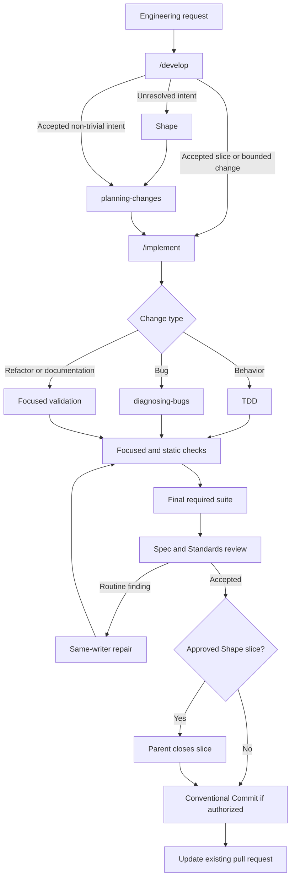

# pi-engineering

`@mopeyjellyfish/pi-engineering` is an independent, skill-and-prompt-only Pi
package. It provides a quality-first coding workflow plus narrow guidance for
public-seam TDD, codebase design, diagnosing bugs, modeling domain language,
and reviewing changes. It has no extension, runtime
dependency, or Pi peer dependency.

The skills use the nearest `CONTEXT.md` for repository language. This
repository's root context file records its canonical terms. Review is
read-only unless a caller explicitly authorizes edits.

The focused implementation, TDD, codebase-design, and diagnosis methods
selectively adapt MIT-licensed guidance from
[mattpocock/skills](https://github.com/mattpocock/skills) at a pinned commit.
Issue-tracker, setup, router, report, interview, and similar scaffolding was not
ported. See [`THIRD_PARTY_NOTICES.md`](THIRD_PARTY_NOTICES.md) for the adapted
file list and complete license.

## Prompts

- `/develop [change request]`
- `/implement [approved slice, bounded request, or confirmed bug outcome]`
- `/diagnose [bug report]`
- `/model-domain [domain or change]`
- `/review-change [fixed point or change]`

Install the package with Pi's normal package installation command. Its narrow
skills remain independently usable. `/develop` and any `/implement` route that needs
delegation or independent review additionally require the Git aggregate agent
set and `pi-subagents`. A missing companion is an actionable blocked
prerequisite, not a reason to weaken the quality gate:

```sh
pi install npm:pi-subagents
pi install git:github.com/mopeyjellyfish/pi-extensions
```

Natural implementation, bug, validation, QA, and review requests can match
`developing-changes`. This flow uses `/implement` as the only implementation
command:



Unresolved product intent goes to Shape. Accepted non-trivial intent goes to
`planning-changes`. Accepted slices and bounded changes go to `implement`.
Small fixes can enter `implement` directly.

Implement composes TDD for behavioral work or focused validation for
non-behavioral work, regular focused and static checks, the final required
suite, and fixed-point Spec and Standards review. Routine findings from
retained execution return to the same writer, which returns its evidence and
exclusive lease when done. The parent verifies every route. For an approved
Shape plan slice, the parent also applies Shape's closure gate and updates the
plan checkbox. A direct bounded request needs no worker lease return or plan
edit. With explicit authority, the parent then creates one Conventional Commit
and pushes it to the existing pull request.

The focused skills own their methods. Shape owns product intent and plan
closure. Planning owns vertical slices. `test-driven-development` owns
public-seam red and green evidence. `codebase-design` owns deep modules, stable
seams, and evidence-based responsibility. `diagnosing-bugs` owns the observable
root-cause loop. `domain-modeling` owns shared terms and concrete scenarios.
`reviewing-changes` owns fixed-point Spec and Standards review. There is no
`engineering-practices` skill.

Sequential, low-risk, locally understandable work that is cheap to validate can
stay in the parent through `/implement` and follows the same quality contract.
Behavioral code uses public-seam red and green evidence. Pure refactors and
non-behavioral work use applicable tests or focused validation instead of
manufactured failures. QA-only work uses a fresh read-only QA agent. One-shot
QA returns evidence without repository records unless records are requested,
reusable, or needed for comparison; QA never replaces formal review.

The private repository aggregate also discovers this package's `skills/` and
`prompts/` directories.
