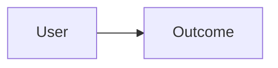

# Shape: {{feature}}

<!--
This is a flexible prompt, not a required heading list. Add, remove, or rename
headings as the feature demands; keep every material decision in this document.
-->

## Executive summary and motivating outcome

Describe the user outcome, current pain, and smallest useful solution.

## Problem and repository truth

Record the motivating story, relevant code/tests/history/documentation evidence,
and why the problem matters. Do not ask for facts the repository answers.

## Qualitative appetite

State scope control, quality floors, acceptable cuts, and stop or reshape
conditions without inventing a delivery estimate.

## Research, prior art, and alternatives

Keep only decision-relevant evidence, prefer primary sources when external
research is material, and state each implication. Compare credible alternatives
and why the recommended direction wins.

## Solution and user experience

Describe behavior, failure paths, system and data flow, and boundaries. Use
Mermaid when a diagram clarifies the contract:

If visual or interaction uncertainty warrants the smallest useful prototype,
link only retained decision evidence and mark it illustrative. Linked assets,
prototypes, and source are non-normative. Embed exact normative API, schema,
protocol, and behavior fragments here so the accepted pitch is self-contained.

## Cross-functional boundaries

Cover accessibility, security, privacy, compatibility, migration, operations,
dependencies, and data handling when material. State what happens at failure,
cancellation, trust, and authorization boundaries.

## Fixed decisions and agent discretion

Separate non-negotiables from implementation choices left to agent discretion.
Include the local banking policy: whether repository guidance authorizes one
local commit per verified slice. Keep push, PR, merge, deploy, publish,
destructive cleanup, and worktree removal separately authorized.

## Rabbit holes and no-gos

Name material risks and their containment, explicit scope cuts, and prohibited
workarounds.

## Acceptance criteria

Use one observable criterion per line in this exact form:

- **AC-NNN — Name:** Observable outcome.
